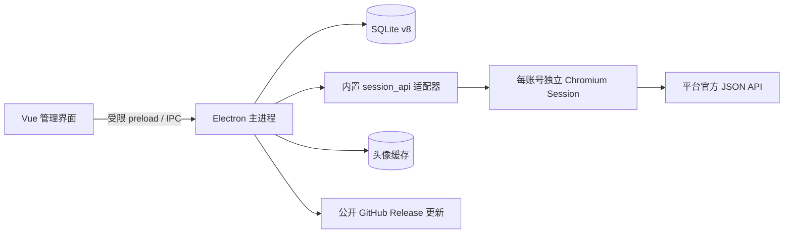

# 归页 / Streamfold

账号归位，内容成册。

归页是一个本地优先的个人社媒账号、内容与统计桌面工作台。它使用 Electron 内置 Chromium 为每个本人账号保存独立登录 Session，通过内置平台适配器读取官方站点返回的 JSON API 数据，再把资料、本人内容和可见指标标准化到本地 SQLite。

当前版本：`0.4.0`。

## 平台状态

| 平台 | 多账号与独立浏览器 | 本人资料/指标 | 本人内容/指标 | 插件状态 |
|---|---|---|---|---|
| 小红书 | 已实现 | 已实现 | 已实现，最近 20/100 条 | 可用，默认关闭 |
| 知乎 | 已实现 | 已实现 | 已实现，最近 20/100 条 | 可用，默认关闭 |
| 微博 | 已实现 | 未开放 | 未开放 | 计划中 |
| 抖音 | 已实现 | 未开放 | 未开放 | 计划中 |

“多账号与独立浏览器”表示可以创建隔离的本地账号空间并在官方入口登录，不代表该平台已经开放数据同步。

## 已实现

- 多平台、多本人账号管理；每个账号绑定独立的 `persist:social:<uuid>` Chromium Session Partition。
- 可选本地备注名、备注、标签、自定义分组、排序、默认账号、批量分组和批量暂停/恢复同步。
- 独立大尺寸账号浏览器，支持官方入口登录、前进后退、刷新、主页、主题与窗口状态同步。
- 后台 workspace lease：核验和主动同步无需预先打开窗口，登录失效时才显示同一个账号浏览器。
- 小红书本人身份、头像、简介、关注、粉丝、累计获赞与收藏、作品、API 摘要及可见作品指标。
- 知乎本人身份、头像、资料、关注、粉丝、累计指标，以及创作中心回答/文章与阅读、赞同、评论、收藏。
- 同步前后身份复验、首次用户确认、插件启用检查、账号/平台互斥、最小间隔和事务提交。
- 工作台、跨账号内容中心、官方原帖入口、7/30/90/365 天分析、账号排行和类型分布。
- JSON/CSV 导出、按账号清空历史、AES-256-GCM + scrypt 加密的完整 SQLite 备份与恢复。
- 浅色、深色、跟随系统主题，可折叠侧栏，原生标题栏、应用弹窗、桌面和托盘图标。
- Windows、macOS、Linux 构建配置，GitHub CI/标签发布，以及标签工作流生成、包含 `app-update.yml` 的正式安装包在线更新。

平台数据链路只接受固定 JSON API 或精确匹配的 Fetch/XHR JSON 响应。当前运行时没有页面 DOM/HTML 解析、手动 Cookie 导入或 JSON/CSV 平台数据导入入口；设置页的 JSON/CSV 只有导出方向。

## 基本使用流程

1. 在“插件”启用小红书或知乎数据同步。
2. 在“账号”添加本地账号；备注名可以留空。
3. 打开独立账号浏览器，在平台官方页面完成登录。
4. 返回账号详情核验当前身份，首次使用时确认绑定。
5. 在“设置与备注”选择同步范围并启用同步。
6. 点击“立即同步”；完成后在内容、数据和工作台查看结果。

更完整的操作、状态处理和清理差异见[使用指南](docs/user-guide.md)。

## 运行架构



- 主进程是数据库、文件、账号 Session 和更新客户端的唯一协调者。
- 管理 Renderer 只获得固定业务方法；远程平台页面没有 preload、IPC、Node.js 或文件系统能力。
- 平台适配器是内置、版本化的 TypeScript 实现，不动态执行任意第三方插件代码。
- SQLite schema 当前为 v8；内容按账号和远端 ID 去重，指标按时间保存变化快照。

进程、数据库与安全边界统一见[运行架构](docs/architecture.md)，平台端点和字段见[平台适配器](docs/platform-adapters.md)。

## 本地开发

要求 Node.js 22.13+ 与 pnpm 10+；仓库锁定 pnpm 10.24.0。

```powershell
pnpm install --frozen-lockfile
pnpm dev
```

验证：

```powershell
pnpm test
pnpm typecheck
pnpm build
pnpm test:smoke
```

构建桌面构件：

```powershell
pnpm dist:dir
pnpm dist:win
pnpm dist:mac
pnpm dist:linux
```

输出目录为 `release/`。跨平台安装包应在对应操作系统上生成。开发、平台接入、CI/CD 和在线更新发布见[开发与发布](docs/development.md)。

## 本地数据

为兼容旧版本，应用继续使用 Electron 用户数据目录中的 `social-vault`：

- `social-vault.sqlite`：账号、分组、内容、指标、任务、插件和设置。
- `profile-media/`：经主进程校验、按内容哈希缓存的头像。
- Chromium Partitions：各账号登录 Session，不写入 SQLite。

SQLite 主文件当前不做静态加密；`.svbackup` 是加密数据库快照。备份不包含登录 Session 或头像文件，恢复流程会清理相关 Session，之后需要重新登录并核验账号。

## 文档

- [使用指南](docs/user-guide.md)
- [运行架构](docs/architecture.md)
- [平台适配器](docs/platform-adapters.md)
- [开发与发布](docs/development.md)
- [设计决策](docs/design-decisions.md)
- [完整文档索引](docs/README.md)

## 当前限制

- 目前只有小红书和知乎开放同步；微博、抖音仍需逐平台接口与测试账号验收。
- 同步由用户对单个账号主动触发，尚无定时同步、串行批量同步队列、Retry-After 调度和连续失败熔断。
- 平台 JSON 接口可能变化；适配器在主机、路径、结构、身份或分页校验失败时会停止本次提交。
- Windows/macOS 生产代码签名、Apple 公证和在线更新的真实公开仓库首次发布尚未完成。
- 首个包含更新器的版本仍需手动安装一次；开发版、目录构建和不支持的便携格式不能应用内更新。
