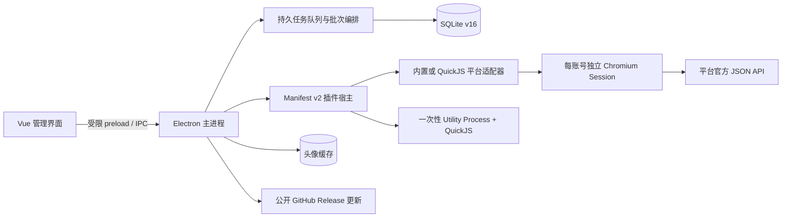

# 归页 / Streamfold

账号归位，内容成册。

归页是一个本地优先的个人社媒账号、内容与统计桌面工作台。它使用 Electron 内置 Chromium 为每个本人账号保存独立登录 Session，通过权限受控的平台适配器读取官方站点返回的 JSON API 数据，再把资料、本人内容和可见指标标准化到本地 SQLite。

当前版本：`0.7.0`。

## 平台状态

| 平台 | 多账号与独立浏览器 | 本人资料/指标 | 本人内容/指标 | 插件状态 |
|---|---|---|---|---|
| 小红书 | 已实现 | 已实现 | 已实现，最近 20/100 条、10 项作品指标 | 可用，默认关闭 |
| 知乎 | 已实现 | 已实现，7/14/30 天、累计和每日趋势 | 已实现，最近 20/100 条及动态创作指标 | 可用，默认关闭 |
| X | 已实现 | 已实现 | 已实现，最近 20/100 条及可见互动指标 | 可用，默认关闭 |
| 微博 | 已实现 | 未开放 | 未开放 | 计划中 |
| 抖音 | 已实现 | 未开放 | 未开放 | 计划中 |

“多账号与独立浏览器”表示可以创建隔离的本地账号空间并在官方入口登录，不代表该平台已经开放数据同步。

## 已实现

- 多平台、多本人账号管理；每个账号绑定独立的 `persist:social:<uuid>` Chromium Session Partition。
- 可选本地备注名、备注、标签、自定义分组、排序、默认账号、批量分组和批量暂停/恢复同步。
- 账号或分组一键批量同步；同步前预览登录、身份、适配器和授权范围，任务按适配器串行、跨适配器并行。
- 统一任务中心汇总账号同步和插件运行，支持状态/平台/账号/来源/处理状态筛选、批次进度、排队取消、失败重试、手动消解和重启恢复；失败历史永久保留，只有未解决项计入“需要处理”。
- 独立大尺寸账号浏览器，支持官方入口登录、前进后退、刷新、主页、主题与窗口状态同步。
- 后台 workspace lease：核验和主动同步无需预先打开窗口，登录失效时才显示同一个账号浏览器。
- 小红书本人身份、头像、简介、关注、粉丝、累计获赞与收藏、作品、API 摘要，以及曝光、观看、封面点击率、点赞、评论、收藏、涨粉、分享、人均观看时长和弹幕。
- 知乎本人身份、头像、资料、关注、粉丝和创作指标；保存 7/14/30 天、累计与最近 30 天每日历史，支持回答、文章、想法、视频及阅读/播放、曝光、赞同、喜欢、互动、完成率、正向互动率和关注者转化等官方指标。
- X 本人稳定身份、头像、简介、关注、粉丝、原创帖和引用帖；保存浏览、点赞、回复、转帖、书签和引用数，不接入开发者 API。
- 同步前后身份复验、首次用户确认、插件启用检查、账号/平台互斥、最小间隔和事务提交。
- 跨账号内容中心提供 FTS5 全文检索、组合筛选、分页排序、本地收藏、批量标签、官方原帖入口和筛选范围 JSON/CSV 导出。
- 可靠分析提供概览、账号/平台/分组对比、24 小时/7 天/30 天内容生命周期和数据质量，并区分累计、周期总量、瞬时值、缺失与修订。
- JSON/CSV 导出、按账号清空历史、AES-256-GCM + scrypt 加密的完整 SQLite 备份与恢复；便携备份剥离并在恢复后重建 FTS 索引。
- 浅色、深色、跟随系统主题，可折叠侧栏，原生标题栏、应用弹窗、桌面和托盘图标。
- Windows、macOS、Linux 构建配置与 GitHub CI/标签发布；Windows、Linux 正式构件支持公开 Release 在线更新，macOS 当前使用手动更新。
- Manifest v2 开放插件宿主、QuickJS Utility Process 沙箱、细粒度授权、签名目录、本地开发插件、事件 Outbox、间隔/每天/每周/每月计划队列，以及随应用签名分发的 X 与官方 Webhook 插件。

平台数据链路只接受固定 JSON API 或按固定来源、路径/GraphQL 操作名精确匹配的 Fetch/XHR JSON 响应。当前运行时没有页面 DOM/HTML 解析、手动 Cookie 导入或 JSON/CSV 平台数据导入入口；设置页的 JSON/CSV 只有导出方向。

## 基本使用流程

1. 在“插件”启用小红书、知乎或 X 数据同步。
2. 在“账号”添加本地账号；备注名可以留空。
3. 打开独立账号浏览器，在平台官方页面完成登录。
4. 返回账号详情核验当前身份，首次使用时确认绑定。
5. 在“设置与备注”选择同步范围并启用同步。
6. 点击单账号“立即同步”，或多选账号/选择分组后创建同步批次。
7. 在“任务”查看排队、采集、提交、失败处理和批次进度；完成后到内容、数据和工作台查看结果。

更完整的操作、状态处理和清理差异见[使用指南](docs/user-guide.md)。

## 运行架构



- 主进程是数据库、文件、账号 Session 和更新客户端的唯一协调者。
- 管理 Renderer 只获得固定业务方法；远程平台页面没有 preload、IPC、Node.js 或文件系统能力。
- 小红书、知乎是可信内置实现；随应用签名分发的 X 适配器和第三方插件在独立 Utility Process 的 QuickJS 上下文运行，只能调用获授权的宿主代理。
- SQLite schema 当前为 v16；五项通用内容指标保留兼容列，平台扩展指标、账号周期指标、每次成功同步的内容观察和版本化指标语义共同保存完整变化历史。FTS 索引可重建，任务失败处置与日历计划持久化；排队任务与批次可在重启后恢复，内容和指标仍按原子事务提交。

进程、数据库与安全边界统一见[运行架构](docs/architecture.md)，平台端点和字段见[平台适配器](docs/platform-adapters.md)。

## 本地开发

要求 Node.js 22.21.1+ 与 pnpm 10+；仓库锁定 pnpm 10.24.0。

```powershell
pnpm install --frozen-lockfile
pnpm dev
```

验证：

```powershell
pnpm test
pnpm typecheck
pnpm build
pnpm sdk:test
pnpm test:ui
pnpm benchmark:content-search
pnpm test:smoke
```

构建桌面构件：

```powershell
pnpm dist:dir
pnpm dist:win
pnpm dist:mac
pnpm dist:linux
```

输出目录为 `release/`。跨平台安装包应在对应操作系统上生成。开发、平台接入、CI/CD 和在线更新发布见[开发与发布](docs/development.md)。

## 本地数据

为兼容旧版本，应用继续使用 Electron 用户数据目录中的 `social-vault`：

- `social-vault.sqlite`：账号、分组、内容、指标、任务、插件和设置。
- `profile-media/`：经主进程校验、按内容哈希缓存的头像。
- Chromium Partitions：各账号登录 Session，不写入 SQLite。

SQLite 主文件当前不做静态加密；`.svbackup` 是脱敏后的加密数据库快照。备份不包含登录 Session、头像文件、插件包或插件 Secret；恢复后需要重新登录核验账号，并重新安装第三方插件、填写 Secret。

## 文档

- [使用指南](docs/user-guide.md)
- [运行架构](docs/architecture.md)
- [平台适配器](docs/platform-adapters.md)
- [开放插件系统](docs/plugin-system.md)
- [开发与发布](docs/development.md)
- [设计决策](docs/design-decisions.md)
- [产品路线图](docs/roadmap.md)
- [完整文档索引](docs/README.md)

## 当前限制

- 目前小红书、知乎和 X 开放同步；微博、抖音仍需逐平台接口与测试账号验收。
- 插件事件和计划均默认关闭，需要用户选择账号/分组并授权；插件计划支持间隔、每天、每周和每月，账号自动同步计划仍未开放，当前批量同步由用户主动发起。
- 远程插件发现的目录 URL 与根公钥会编译进发布构建；未配置远程目录时会明确禁用“发现”，内置平台、签名 Webhook 和开发者模式仍可使用。
- 平台 JSON 接口可能变化；适配器在主机、路径、结构、身份或分页校验失败时会停止本次提交。
- Windows Authenticode、macOS Developer ID 签名与 Apple 公证尚未完成；未签名 macOS 构件不启用应用内更新。
- 首个包含更新器的版本仍需手动安装一次；开发版、目录构建和不支持的便携格式不能应用内更新。
