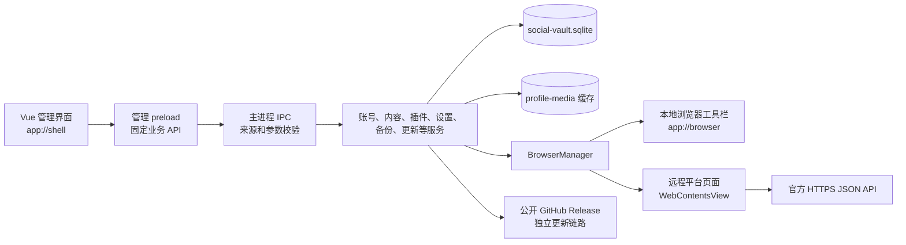
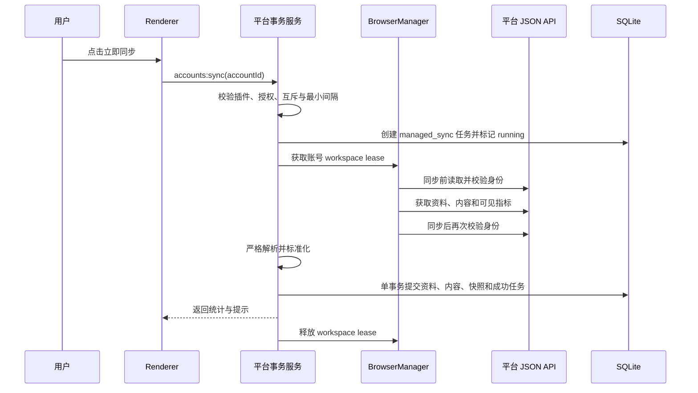

# 运行架构

> 适用版本：归页 Streamfold 0.4.0
>
> 更新日期：2026-07-14
>
> 本文同时汇总进程、数据库与安全边界；产品方案取舍见[设计决策](design-decisions.md)。

## 1. 技术栈与入口

| 层 | 当前实现 | 主要入口 |
|---|---|---|
| 桌面运行时 | Electron 43 | `src/main/index.ts` |
| 管理界面 | Vue 3 + TypeScript | `src/renderer/src/App.vue` |
| 构建 | electron-vite 5、Vite 7 | `electron.vite.config.ts` |
| 本地数据库 | Node.js `node:sqlite` | `src/main/database.ts` |
| 数据库迁移 | `PRAGMA user_version`，当前 v8 | `src/main/storage/migrations.ts` |
| 安装包 | electron-builder | `package.json` 的 `build` 配置 |
| 在线更新 | electron-updater | `src/main/update-service.ts` |
| 测试 | Vitest + Electron smoke | `*.test.ts`、`scripts/smoke.mjs` |

`src/main/index.ts` 是组合根：创建数据库、浏览器管理器、平台适配器、导出、备份、设置和更新服务，并把这些服务注册到受限 IPC。

## 2. 进程与信任边界



### 管理窗口

- 从自定义安全协议 `app://shell` 加载本地构建产物。
- 开启 `contextIsolation`、`sandbox` 和 `webSecurity`，关闭 Node 集成、`webviewTag` 和拖放导航。
- `src/preload/index.ts` 只暴露 `SocialVaultApi` 中声明的方法，不暴露原始 `ipcRenderer`。
- `src/main/ipc.ts` 同时校验主窗口 `webContents`、主框架和 `app://shell` 来源，并对所有输入执行白名单解析。

### 账号浏览器窗口

账号浏览器不是嵌入主界面的网页区域，而是一个独立 `BrowserWindow`：

- 顶部工具栏从 `app://browser` 加载，使用单独的 `src/preload/browser.ts`。
- 平台页面运行在工具栏下方的 `WebContentsView` 中，不加载 preload，也没有 IPC、Node.js、数据库或文件系统能力。
- 每个账号只保留一个 workspace；再次打开会聚焦现有窗口。
- 远程视图禁用 DevTools、下载、站点权限、弹窗和非官方顶层导航。

## 3. 账号会话与浏览器生命周期

账号创建时生成 UUID，并固定使用：

```text
persist:social:<account_uuid>
```

该持久 Session Partition 隔离 Cookie、缓存、LocalStorage、IndexedDB 和 Service Worker。关闭账号浏览器窗口不会清除 Session；“退出登录”会清理该 Partition 的认证缓存、网络缓存和全部站点存储；“永久删除”还会删除本地账号及其关联数据。

核验或同步不要求用户预先打开窗口。`BrowserManager` 为操作获取 workspace lease：

1. 有现成 workspace 时复用。
2. 没有时在后台创建不可见 workspace，并准备平台同源页面。
3. 会话有效时完成操作并在最后一个 lease 释放后销毁纯后台 workspace。
4. 登录失效时把同一个 workspace 提升为可见窗口，供用户在官方页面重新登录。

应用不会从外部 Chrome 读取登录数据，也不会把 Session 写入 SQLite 或加密备份。

## 4. 平台同步分层

同步代码分成四层：

| 层 | 职责 | 当前实现 |
|---|---|---|
| 平台路由 | 根据账号平台选择适配器 | `platform-sync-service.ts` |
| 事务服务 | 锁、限频、身份状态、任务、头像和数据库提交 | `xiaohongshu-api-service.ts`、`zhihu-api-service.ts` |
| API 与解析 | 固定端点、分页、字段校验、标准化和身份前后复验 | `xiaohongshu-api.ts`、`zhihu-api.ts` |
| 浏览器传输 | 同源固定 GET 或精确 XHR/Fetch JSON 响应捕获 | `browser-manager.ts` |

平台插件目前是内置 TypeScript 适配器及其只读清单，不是可执行任意代码的第三方插件。注册表位于 `src/main/plugins/registry.ts`；只有 `availability = available` 且由用户启用的适配器可以运行。

### JSON 数据传输

当前只有两条数据路径：

1. 在账号自己的已登录页面环境中，对固定白名单端点执行同源 `GET`。
2. 对需要平台页面生成请求上下文的接口，使用 Chromium DevTools Protocol 的 `Network` 域捕获精确匹配的 Fetch/XHR JSON 响应。

第二条路径只使用请求方法和 URL 来匹配响应，再读取响应正文；不会从页面 DOM 或 HTML 提取数据。响应在进入业务模型前还会校验协议、主机、路径、状态码、Content-Type、大小、分页、ID、计数和字符串长度。

## 5. 一次主动同步



关键约束：

- 新账号默认不授权同步；首次身份绑定后仍需用户在账号设置中启用。
- 同一账号的核验与同步互斥，同一平台一次只执行一个同步任务。
- 小红书插件最小间隔为 60 秒；知乎插件最小间隔为 300 秒。
- 采集前后身份必须与本地 `remote_id` 一致，采集期间切换账号会使整次同步失败。
- `commitManagedSync` 会在事务内再次核对账号授权范围、任务状态和插件启用状态。
- 内容按 `(account_id, remote_id)` 去重；完全未变化的连续指标不会新增内容快照。

当前没有后台定时同步或批量同步队列，所有平台同步由用户对单个账号主动触发。

## 6. 本地数据与媒体

主数据库位于 Electron 用户数据目录下的 `social-vault.sqlite`。为兼容旧版本，应用名称虽然已经改为 Streamfold，用户数据目录仍固定为 `social-vault`。

平台头像不直接交给 Renderer 下载。`ProfileMediaStore` 会校验允许的 CDN、逐跳重定向、MIME、文件头、声明大小和实际大小，再按 SHA-256 内容哈希写入 `profile-media`。Renderer 只能通过 `app://shell/media/...` 读取缓存。

### 主要数据表

| 表 | 用途与关键约束 |
|---|---|
| `accounts` | 平台身份、本地整理、状态、同步授权与唯一 Session Partition；同平台非空远端 ID 不重复 |
| `groups` / `account_groups` | 分组及账号多对多关系；删除分组不删除账号 |
| `account_snapshots` | 关注、粉丝、内容数及账号指标时间序列；缺失指标为 `NULL` |
| `contents` | 标准化内容、API 摘要、官方原帖 URL 与本地备注；账号内远端 ID 唯一 |
| `content_snapshots` | 内容指标时间序列；连续指标完全相同时跳过重复快照 |
| `plugin_installations` | 内置插件清单、启用状态、运行次数和最近错误 |
| `jobs` | 同步任务、阶段、进度、结果和错误；当前运行时只创建 `managed_sync` |
| `sync_cursors` | 预留的分页/增量游标；当前主动同步按安全上限重新读取 |
| `app_settings` | 主题、更新、导出、备份和恢复时间等本机设置 |
| `import_batches` | 旧版文件导入兼容表；当前没有导入服务、IPC、插件或界面入口 |

SQLite 以 `DatabaseSync` 打开，关闭扩展加载并启用 defensive、外键与 WAL。主要账号从表使用 `ON DELETE CASCADE`；Chromium Partition 和头像文件由主进程服务另行清理。

schema 通过 `PRAGMA user_version` 逐版迁移，当前为 v8。迁移在 `BEGIN IMMEDIATE` 事务中执行；数据库版本高于应用支持版本时拒绝打开。v4 增加数据库级同步授权触发器，v5 清理旧 DOM/文件插件状态，v6 增加头像与备注名状态，v7 迁移小红书原帖 URL，v8 去除连续重复内容快照。

`raw_retention_days` 和旧导入表/合同目前只用于兼容，没有原始平台响应存储或清理消费者，也不代表支持 JSON/CSV 平台数据导入。

## 7. 安全控制

安全设计假设平台页面、网络响应和 Renderer 都不可信：

- 管理窗口和本地工具栏启用 `contextIsolation`、sandbox 与 `webSecurity`，关闭 Node 集成和 `webviewTag`。
- 远程平台视图没有 preload、IPC、Node.js、数据库或文件系统能力；拒绝权限、下载、新窗口、无效 TLS 与 HTTP Basic/Digest 登录提示。
- 顶层导航和重定向使用平台精确 HTTPS hostname 白名单；平台所需的安全子框架资源不按顶层主机规则拦截。
- 每个 IPC 通道固定，并校验发送窗口、主框架、`app://` 来源和运行时参数结构。
- Renderer 不能传入数据库路径、任意文件路径、更新源、任意平台 URL、任意脚本、Cookie 或 Session 对象。
- 平台响应进入模型前校验协议、主机、路径、方法、查询参数、状态、Content-Type、大小、分页、ID 和字段范围。
- 原帖打开前再次匹配平台、内容类型、远端 ID、官方主机和固定路径。

SQLite 主文件当前未静态加密，应结合操作系统账号、磁盘加密和文件权限保护。JSON/CSV 导出为明文；`.svbackup` 使用 AES-256-GCM 与 scrypt。正式分发仍需 Windows/macOS 代码签名与 Apple 公证，更新清单哈希不能替代发布者签名。

## 8. 导出、备份与恢复

- JSON/CSV 导出由 `ExportService` 从标准化数据库记录生成；CSV 会处理中英文逗号、引号、换行和表格公式前缀。
- `.svbackup` 由 `BackupService` 备份完整 SQLite 数据库，使用 AES-256-GCM 与 scrypt 加密。
- 恢复进入全局维护状态，等待当前 IPC 操作结束，关闭账号浏览器，在临时数据库完成格式、schema、完整性和外键校验后才替换现有数据库。
- Session Partition 和头像文件不进入数据库备份；恢复后会清理相关会话并要求重新核验。

## 9. 在线更新

更新服务只在有 `app-update.yml` 的正式安装包中启用；开发、smoke/review、缺少更新源以及非 AppImage 的 Linux 包均标记为不支持，不发起检查。

- 默认启动 15 秒后检查，此后每 6 小时检查。
- 发现版本后自动后台下载，安装必须由用户确认。
- 更新服务使用 electron-updater 的应用级网络链路，不复用任何社媒账号 Session。
- Renderer 不能指定更新源、版本或文件路径。
- 数据恢复或其他受跟踪业务操作运行时，主进程拒绝重启安装。

发布端约束见[开发与发布](development.md)。

## 10. 代码目录

```text
src/
├─ main/                 Electron 主进程、服务、数据库和平台适配器
│  ├─ plugins/           内置插件注册表与类型
│  ├─ services/          任务服务
│  └─ storage/           SQLite 迁移
├─ preload/              管理窗口与账号浏览器的窄化桥接
├─ renderer/             Vue 管理界面与浏览器工具栏
│  └─ src/features/      账号、内容、分析、插件、设置和更新模块
└─ shared/               IPC 两侧共用的合同和枚举
```

开发、测试和发布步骤见[开发与发布](development.md)，平台端点与字段见[平台适配器](platform-adapters.md)。
