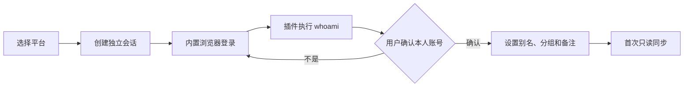

# Social Vault 界面与功能设计

> 版本：概念设计 v0.1
> 产品形态：Windows / macOS / Linux 桌面客户端，内置托管 Chromium，只管理和采集用户本人账号。

## 1. 产品结构

主导航保持六个入口：

| 模块 | 作用 |
|---|---|
| 工作台 | 查看所有账号状态、待处理提醒和核心数据变化 |
| 账号 | 分组、备注、标签、登录、切换和打开内置浏览器 |
| 内容 | 跨平台查看本人发布的文章、帖子、图文和视频 |
| 数据 | 账号趋势、内容表现、跨平台对比和导出 |
| 插件 | 安装、启用、升级和诊断平台采集插件 |
| 设置 | 数据存储、安全、同步频率、备份和日志管理 |

首屏默认进入“账号”，因为登录账号管理是整个产品的起点。

## 2. 账号中心

账号中心采用双栏结构，分组收进账号列表顶部的筛选器，避免长期占用一整列：

```text
┌──────────────────────────┬─────────────────────────────────────┐
│ 账号列表                 │ 账号详情                            │
│ 搜索 + 分组筛选          │ 头像 / 别名 / 登录状态             │
│                          │ 总览 / 浏览器 / 内容 / 设置         │
│ 小红书 · 个人品牌号      │ 指标、接入步骤和本地设置           │
│ 微博 · 工作资讯号        │                                     │
│ 抖音 · 短视频实验号      │ 浏览器通过按钮在独立大窗口中打开   │
└──────────────────────────┴─────────────────────────────────────┘
```

### 2.1 分组筛选

- 固定分组：全部账号、未分组、登录异常、已暂停。
- 自定义分组：支持名称、颜色、排序和拖动调整。
- 分组使用紧凑下拉筛选和创建按钮，不单独占用页面列。
- 一个账号可以加入多个分组。
- 删除分组不删除账号、登录会话和历史数据。
- 分组支持批量暂停同步、批量导出；批量断开账号不开放。

### 2.2 账号列表

每行只显示高频信息：

- 平台图标、头像、本地别名和平台昵称。
- 登录状态：正常、需登录、冷却、暂停、插件不可用。
- 最近同步时间。
- 标签与备注通过搜索命中，不在列表堆叠展示。

列表支持按平台、分组、标签、登录状态和同步状态筛选。账号排序支持手工排序、最近同步、粉丝数和异常优先。

### 2.3 账号详情

账号详情包含四个页签：

1. **总览**：粉丝、内容、累计互动、趋势图和最近内容。
2. **浏览器**：显示会话和安全状态，并打开该账号的独立浏览器工作窗口。
3. **内容数据**：该账号所有已采集内容及指标变化。
4. **设置与备注**：本地别名、备注、标签、分组、同步策略和断开账号。

## 3. 内置浏览器

内置浏览器使用 Electron 随应用分发的真实 Chromium，但不是 Chrome 的完整复制品。界面必须明确显示“内置 Chromium”，不能用“与 Chrome 完全相同”误导用户；平台拒绝嵌入式登录时停止该流程，不提供伪装或绕过功能。

### 3.1 独立浏览器工作窗口

- 每个账号对应一个固定的 Chromium Session Partition。
- 每个账号最多打开一个工作窗口；重复打开时聚焦已有窗口。
- 不同账号之间不共享 Cookie、缓存、LocalStorage 或 Service Worker。
- 窗口标题和工具栏始终显示“平台 · 本地别名”，避免同平台多账号混淆。
- 远程网页使用无 preload 的沙箱 `WebContentsView`；工具栏使用单独的受限本地 preload。
- 浏览器内容区域随独立窗口缩放，不再依赖主界面 DOM 坐标，也不产生嵌套滚动。
- 关闭工作窗口保留登录态；“断开登录会话”清除该账号 Session 但保留账号与历史数据；永久删除本地账号是另一个需要单独确认的操作。

### 3.2 浏览器工具栏

- 后退、前进、刷新、主页。
- 地址栏显示完整协议和主机名，并用“平台官方域名”状态标识区分已审核与未知页面。
- 只允许 `https` 和插件声明的精确官方域名、官方 SSO 域名；未知域名、证书错误和混合内容直接阻止。
- 越界链接不会在当前账号会话中打开；确需外部打开时先展示目标域名并再次校验。
- 当前账号标识与平台图标始终可见。
- “采集当前账号”按钮只在插件支持的页面启用。
- 登录异常时显示“重新登录”，不会自动提交密码或重复验证码。

### 3.3 采集状态

浏览器右上角显示轻量状态：

- 未采集：正常浏览，不执行任何提取。
- 正在同步：显示当前阶段和取消按钮。
- 冷却中：显示可再次尝试的时间。
- 身份不匹配：立即停止采集，要求重新确认账号。

客户端不提供 Canvas/WebGL 修改、代理池、验证码识别、设备指纹随机化或其他反检测能力。

### 3.4 官方登录安全模式

- “添加账号”只打开应用内预置并经审核的平台官方登录入口，不允许用户把任意网页设为登录入口。
- 登录期间顶部固定显示平台名称、完整官方域名、当前账号会话和“登录阶段暂停采集”。
- 客户端不读取、记录、自动填写或转发密码、短信验证码和扫码内容。
- 登录页不运行采集插件；用户登录完成并点击“确认这是我的账号”后，插件才执行只读身份校验。
- 平台要求重新验证时由用户手动处理；客户端不循环重试，不调用验证码服务。
- 平台不接受内置浏览器时，优先官方 OAuth、设备码或官方扫码；没有官方安全方案则暂停该平台接入。

## 4. 添加账号流程



具体步骤：

1. 点击“添加账号”，选择平台。
2. 客户端创建新的持久 Session Partition。
3. 在内置浏览器打开平台登录页，由用户完成登录、扫码和验证码。
4. 登录期间采集插件保持禁用，地址栏持续显示并校验官方域名。
5. 登录成功后用户点击“确认这是我的账号”，插件才执行轻量 `whoami`，展示头像、昵称和远端账号 ID。
6. 用户核对身份；如果不一致，清除本次绑定并返回官方登录页切换账号。
7. 设置本地别名、一个或多个分组、标签和备注。
8. 选择首次同步范围：仅资料、最近 20 条、最近 100 条或暂不同步；默认仅同步账号资料。

同一平台、同一远端账号重复添加时，提示合并到已有账号，不创建重复记录。

## 5. 内容中心

### 5.1 内容列表

统一展示本人内容：文章、回答、帖子、图文和视频。默认字段包括：

- 平台、账号、内容类型、标题或正文摘要。
- 发布时间、原文链接、采集时间。
- 浏览、点赞、评论、分享、收藏。
- 指标相较上一次采集的变化。

支持按账号、分组、平台、内容类型、时间范围和关键词筛选。

### 5.2 内容详情

- 基本信息与原文入口。
- 指标趋势，而不是只显示最新值。
- 每次采集的时间和数据来源。
- 平台原始指标名称及归一化指标的对应关系。
- 本地内容备注和标签。

客户端不默认保存完整媒体文件；图片和视频只记录平台 URL。用户主动选择备份本人媒体时才下载到指定目录。

## 6. 数据中心

### 6.1 账号分析

- 粉丝、内容数、浏览和互动的 7/30/90 天趋势。
- 发布频率和内容类型分布。
- 最近增长最快和下降最明显的内容。
- 数据缺失、四舍五入或不可比较时明确标注。

### 6.2 跨平台分析

- 按本地分组汇总账号表现。
- 对比同一内容方向在不同平台的表现。
- 分开展示不同互动率口径，不强行把平台指标混成一个分数。
- 支持 CSV、JSON 和 XLSX 导出。

### 6.3 首页提醒

- 登录失效或账号身份不匹配。
- 插件升级后需要重新授权。
- 平台进入冷却或同步连续失败。
- 最近一周数据明显变化。
- 本地备份长时间未执行。

## 7. 插件中心

每个平台插件显示：

- 名称、版本、许可证、来源和固定 Commit Hash。
- 支持能力：资料、内容列表、账号指标、内容指标、文件导入。
- 采集方式：官方免费 API、内置浏览器、Sidecar 或文件导入。
- 风险等级、允许访问的域名和建议同步间隔。
- 最近运行时间、成功率和错误摘要。

插件操作包括安装、启用、暂停、升级、回滚、诊断和卸载。第三方插件默认不自动运行，安装前必须展示权限清单。插件不能直接访问 SQLite、其他账号会话或系统钥匙串。

## 8. 设置与安全

### 8.1 数据

- 查看数据库和媒体备份占用空间。
- 按账号导出、备份、恢复和彻底删除本地数据。
- 设置原始调试响应保留时间，默认 7 天，也可关闭。
- 数据库默认不开云同步。

### 8.2 浏览器会话

- 查看账号与 Session Partition 的绑定关系。
- 清理单个账号缓存，不影响其他账号。
- 删除登录会话前二次确认。
- 平台登录页不启用 Node.js，开启上下文隔离和 Chromium 沙箱。
- 保持同源策略和 `webSecurity` 开启，默认拒绝摄像头、麦克风、定位、通知、剪贴板和下载权限；官方扫码确有需要时逐次请求用户授权。
- 限制导航、子框架与新窗口到审核域名；证书错误不可忽略。
- 显示当前 Electron/Chromium 版本和安全更新状态；版本过旧时暂停登录。

### 8.3 日志

- 日志自动遮盖 Cookie、Token、手机号、邮箱和账号密码。
- 崩溃报告默认只保存在本地。
- 用户导出诊断包前显示文件清单，并再次执行敏感字段清理。

## 9. 功能优先级

### P0：首个可用版本

- 独立 Chromium 工作窗口、多账号持久会话和窗口恢复。
- 添加、重新登录、暂停、断开账号。
- 分组、备注、标签、搜索和组合筛选。
- `whoami` 身份绑定及同步前校验。
- 小红书、微博、抖音三个只读插件。
- 本地 SQLite、内容去重、指标快照和基础趋势。
- JSON/CSV/ZIP 通用导入与 CSV/JSON 导出。

### P1：内容统计完整版

- 知乎、微信公众号和 X 插件。
- 内容中心、跨平台分组对比和 7/30/90 天趋势。
- 插件升级、回滚、诊断和错误恢复。
- 本地加密备份及 XLSX 导出。

### P2：后续增强

- 浏览器窗口布局恢复、多显示器位置记忆和受管认证弹窗。
- 用户主动触发的本人媒体备份。
- 更细的指标口径和自定义报表。
- Instagram、TikTok、LinkedIn 等高风控平台的可行性验证。

不进入当前范围：自动发布、删除、评论、点赞、关注、私信、账号池、代理池和指纹伪造。

## 10. 关键交互原则

- 每个写操作都只修改本地数据；涉及平台写入的能力默认不存在。
- 账号身份、登录状态和当前会话在所有关键页面保持可见。
- 登录异常不无限重试，验证码必须交给用户处理。
- 删除分组、插件或浏览器缓存不能意外删除历史统计。
- 断开账号、删除会话和删除历史数据是三个独立操作。
- 首次同步范围由用户选择，避免登录后立即大量请求平台。
