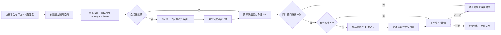

# 归页 Streamfold 界面与功能设计

> 版本：0.4.0
> 产品形态：Windows / macOS / Linux 桌面客户端，仅管理用户本人的社媒账号与统计数据。

## 1. 设计目标

归页把账号登录、账号整理、本人内容同步和统计分析放在一个桌面应用中。界面遵循三条原则：

1. 账号管理优先。用户先建立账号空间，再登录、核验身份和同步数据。
2. 浏览器独立可用。平台页面在大尺寸独立窗口中运行，不塞进主界面的狭窄详情栏。
3. 状态可行动。页面只给出下一步操作、进度和错误恢复方式，不长期展示实现声明。

## 2. 信息架构

主导航包含六个入口：

| 模块 | 主要任务 |
|---|---|
| 工作台 | 查看账号、内容、浏览和互动概览，以及需要处理的账号状态 |
| 账号 | 添加账号、搜索筛选、分组备注、登录、身份核验和同步 |
| 内容 | 跨账号查看本人内容、最新指标、指标变化、标签和备注 |
| 数据 | 查看 7/30/90/365 天趋势、账号排行和内容类型分布 |
| 插件 | 查看平台适配器能力、可用状态、启停状态和最近运行结果 |
| 设置 | 查看存储统计、导出数据、创建或恢复加密备份、清理账号历史 |

首次使用默认进入账号中心。主窗口不承担平台网页浏览，平台网页始终在对应账号的独立浏览器窗口中打开。

## 3. 账号中心

账号中心采用“账号列表 + 账号详情”双栏布局：

```text
┌────────────────────────────┬──────────────────────────────────────┐
│ 搜索账号                   │ 头像  备注名/平台昵称    打开浏览器 │
│ 分组筛选                   │                                      │
│ □ 小红书 · 个人号          │ 总览  浏览器  内容数据  设置与备注  │
│ □ 小红书 · 工作号          │                                      │
│ □ 微博 · 品牌号            │ 当前状态、下一步操作和账号数据      │
└────────────────────────────┴──────────────────────────────────────┘
```

### 3.1 账号列表

- 搜索范围包括本地备注名、平台昵称、平台账号 ID、简介、备注和标签。
- 可按全部账号、未分组、登录异常、已暂停和自定义分组筛选。
- 每行显示平台、真实头像或平台简称、本地备注名的回退显示名、平台昵称、平台账号 ID 和当前状态。
- 支持多选当前结果，批量加入或移出分组，以及批量暂停或恢复同步。
- 创建账号时选择平台和初始同步范围；本地备注名可选，留空时先显示“平台账号”，首次身份绑定成功后采用平台昵称。

### 3.2 分组、标签与备注

- 自定义分组包含名称、颜色和排序；一个账号可以属于多个分组。
- 删除分组只解除关系，不删除账号、登录会话和历史数据。
- 标签用于轻量分类，备注用于负责人、内容方向或运营说明。
- 分组、标签、本地备注名和备注只存在本地，不写回平台。用户主动填写不同的备注名后，后续同步不会覆盖它；清空备注名会恢复自动跟随平台昵称。
- 默认账号按平台设置，用于工作台和筛选器的默认选择。

### 3.3 账号详情页签

| 页签 | 内容 |
|---|---|
| 总览 | 平台头像、昵称、账号 ID、简介、关注、粉丝、累计获赞与收藏，以及连接、身份、同步状态和使用步骤 |
| 浏览器 | 浏览器窗口状态、当前地址、打开或切换到独立窗口、核验身份和同步 |
| 内容数据 | 该账号最近内容、最新指标、采集时间和内容中心入口 |
| 设置与备注 | 可选本地备注名、备注、标签、分组、同步范围、默认账号和暂停状态 |

总览中的使用步骤依次为：添加账号、完成平台登录、核验当前账号、同步账号数据。已经完成的步骤显示完成状态，未完成的步骤提供对应按钮。

### 3.4 状态模型

连接、身份和同步分别展示，避免把所有问题压成一个“异常”状态：

| 维度 | 主要状态 | 用户操作 |
|---|---|---|
| 连接 | 等待登录、可用、已过期、不匹配、已断开 | 核验或同步时自动打开登录窗口、重新登录或断开会话 |
| 身份 | 未确认、待确认、已核验 | 核对平台昵称与远端 ID，确认本人账号 |
| 同步 | 未开启、空闲、运行中、冷却、失败、平台暂不可用 | 调整范围、重试或等待冷却结束 |

只有登录可用、身份已核验、同步范围不是 `disabled` 且用户已开启同步时，才允许提交平台数据。浏览器窗口是否已经可见不属于同步前置条件。

## 4. 每账号独立浏览器

### 4.1 窗口结构

应用随 Electron 分发 Chromium。每个账号对应一个独立浏览器工作窗口，窗口由两部分组成：

- 本地工具栏：账号标识、后退、前进、刷新、主页、地址状态和关闭按钮。
- 平台内容区：无业务 preload 的远程 `WebContentsView`，占据工具栏以外的完整可用区域。

浏览器窗口可独立移动、缩放和最大化。重复打开同一账号时聚焦现有窗口，不创建多个相同会话窗口。关闭窗口只关闭视图，账号登录状态继续保存在该账号的持久 Session 中。

### 4.2 会话隔离

每个账号创建时分配 `persist:social:<account_uuid>` Session Partition。不同账号不共享 Cookie、缓存、LocalStorage、IndexedDB 或 Service Worker，因此同一平台可以同时管理多个本人账号。

“断开登录会话”会关闭该账号窗口并清理该 Partition 的站点数据，但保留本地账号和统计历史。“清空本地历史”只删除已同步的资料、内容和指标快照。两项操作分别确认。

### 4.3 导航与交互

- 主页按钮回到平台清单声明的官方入口。
- 地址区域显示完整 HTTPS 主机名和是否属于该平台允许的官方域名。
- 导航、重定向、子框架和新窗口目标都经过主进程校验。
- 浏览器状态变化同步回账号详情，包括当前 URL、加载状态、前进后退能力和窗口是否已打开。
- 平台要求登录或验证时，由用户直接在平台页面完成；应用不会在后台反复重试。
- 用户主动核验或同步时，应用先在后台获取隐藏 workspace lease 并复用账号 Session；会话有效时无需显示窗口，登录失效时才将同一个 workspace 显示为官方浏览器窗口。
- lease 的获取、提升与释放由主进程统一管理，并保持同平台单并发，为后续串行批量同步队列提供相同生命周期。

## 5. 添加与核验账号流程



首次核验生成 5 分钟有效的确认令牌。每轮资料读取都用 `user/info` 的 `redId` 与 `personal_info` 的远端 ID 交叉校验；用户确认后再次读取，两次结果一致才绑定远端 ID。后续核验直接比较当前 API 身份和本地绑定身份。

## 6. 同步交互

### 6.1 同步范围

| 模式 | 行为 |
|---|---|
| `profile_only` | 同步个人资料和账号指标，不读取作品列表 |
| `recent_20` | 同步资料、账号指标和最多 20 条本人作品 |
| `recent_100` | 同步资料、账号指标和最多 100 条本人作品 |
| `disabled` | 保留账号和历史数据，不访问平台数据接口 |

当前同步由用户手动触发。点击后应用自动复用该账号的后台 workspace lease，不需要先打开浏览器；发现登录失效时才显示官方浏览器窗口。按钮在身份或授权条件不满足时禁用，并在附近显示可执行的恢复动作。

### 6.2 数据来源

平台适配器只处理 JSON 数据：

- 固定、无需页面签名的接口，由已登录账号浏览器在平台同源发起请求。
- 需要页面生成签名参数的接口，打开固定平台页面并捕获该页面自身 XHR/Fetch 的 JSON 响应。
- 响应通过主机、路径、状态码、Content-Type、大小和字段结构校验后才进入标准化流程。
- 小红书资料同时读取 `GET /api/galaxy/user/info` 和 `GET /api/galaxy/creator/home/personal_info`，以平台账号 ID 交叉校验身份，并组合头像、昵称、简介、关注、粉丝、累计获赞与收藏。
- 小红书作品摘要来自列表/分析 JSON 的 `desc`，或缺失时由本人作品的创作中心编辑路由触发精确 `GET /web_api/sns/capa/postgw/note/detail` JSON，并读取校验过作品 ID 的 `data.desc`；只补空值并串行限频。
- 知乎用 `/api/v4/me` 和本人成员资料交叉校验稳定身份，再以创作中心“内容管理”的统一 JSON 列表同步本人回答、文章及其阅读、赞同、评论和收藏指标；无需打开内容管理页面。
- 头像由主进程校验小红书 HTTPS/CDN 来源、图片 MIME、文件头和 512 KiB 上限后缓存；界面只加载同源 `app://shell/media` 地址，不直连远程 CDN。

平台页面结构和可见文本不作为数据来源；接口失败时同步失败，不切换到页面元素提取。当前产品也没有手动 JSON/CSV 导入入口。

### 6.3 同步结果

- 同步成功后刷新账号资料、账号指标、内容列表和内容指标快照。
- 小红书同步结果显示作品总数与已保存摘要数；详情 JSON 明确返回空 `desc` 的作品标记为平台未提供摘要，只有实际失败或超出本次预算的项目才提示后续继续补齐。
- 同一作品按 `(account_id, remote_id)` 去重。
- 指标发生变化时追加新快照；与上一次全部指标相同时不追加重复快照。
- 同步前后都核对远端身份，身份变化时不提交本次数据。
- 失败信息保存在任务记录和插件运行状态中，界面给出重新登录、等待或重试建议。

## 7. 内容中心

### 7.1 列表与筛选

内容中心统一显示本人发布的文章、帖子、图文、视频和回答，支持：

- 按关键词、账号、平台、内容类型和日期范围筛选。
- 查看标题、正文摘要、账号、发布时间、采集时间和最新浏览、点赞、评论、分享、收藏指标；关键词搜索同时覆盖标题与摘要。
- 查看相较上一个快照的指标变化。
- 进入原平台内容或数据详情页。
- 账号详情的“内容数据”页签同步展示每条正文摘要和“含摘要数/作品数”，内容变更后自动刷新。

平台接口没有提供的字段显示为“暂无”，不从页面文本补齐。

### 7.2 内容详情

- 基本信息、API 正文摘要、原文链接、本地标签和本地备注。
- 按采集时间排列的指标快照。
- 最新值与上一次值的差异。
- 清空历史操作按账号执行，并与删除账号、断开登录会话区分。

## 8. 数据与工作台

### 8.1 工作台

工作台显示账号总数、可用账号、需处理账号、内容总数、浏览和互动汇总，并列出登录过期、身份不匹配、同步失败等可行动提醒。

### 8.2 数据分析

- 时间范围：7、30、90、365 天。
- 趋势：浏览、互动和粉丝快照。
- 账号排行：内容数、浏览、互动和粉丝。
- 内容类型分布：文章、帖子、图文、视频和回答。

不同平台指标定义可能不同，跨平台汇总用于观察趋势，账号与内容详情仍保留平台原始字段是否可用的状态。

## 9. 插件中心

插件中心只管理平台适配器，不管理文件导入器。每个适配器展示：

- 名称、版本、来源与固定提交标识。
- 当前可用、计划中或停用状态。
- 资料、账号指标、内容列表和内容指标能力。
- 允许访问的官方主机、最小请求间隔和建议同步频率。
- 启用状态、最近运行时间、成功/失败次数和最近错误。

当前 `xiaohongshu-session-api` 和 `zhihu-session-api` 可启用；微博和抖音作为计划中适配器展示，不能执行同步。

## 10. 设置、导出与备份

### 10.1 数据导出

- JSON：导出本地账号、内容和指标快照的结构化数据。
- CSV：导出内容列表，进行引号转义并中和电子表格公式前缀。
- 可导出全部账号或单个账号；导出不会修改本地数据，也不会包含 Chromium Session。

导出是把已有本地数据交给用户使用，不是平台数据导入通道。

### 10.2 加密备份与恢复

- `.svbackup` 包含完整 SQLite 数据库，使用 AES-256-GCM 与 scrypt 加密。
- 备份不包含 Chromium 登录 Session，恢复后需要重新核验账号身份。
- 恢复前在临时文件执行格式、版本、哈希、数据库完整性和外键检查。
- 恢复失败保持现有数据库不变；恢复成功后关闭账号浏览器并暂停同步。

### 10.3 本地清理

- 按账号清空资料、内容和指标历史。
- 断开账号登录会话。
- 永久删除本地账号。

这些操作分别呈现范围和确认信息，避免用户误删登录状态或统计历史。

## 11. 当前范围与后续

0.4.0 已实现账号管理、分组备注、独立浏览器、小红书与知乎身份核验和一键主动同步、内容与分析、插件状态、导出和加密备份恢复。

后续优先事项：

1. 完成小红书正文摘要、真实多页大账号、429/461/471 冷却、登录过期和账号切换的更多在线环境验收。
2. 增加可配置的定时同步、连续失败熔断和恢复提示。
3. 完成知乎真实账号多页、限流和身份切换验收，再按相同 `session_api` 合同接入微博与抖音；没有稳定 JSON 接口的平台保持不可用。
4. 完成三平台安装包、签名、自动更新和 CI 发布流程。

自动发布、删除、评论、点赞、关注、私信、账号池、代理池和设备指纹伪造不属于本产品范围。
