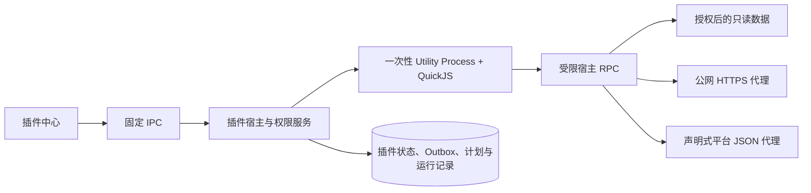

# 开放插件系统

> 适用版本：归页 Streamfold 0.5.0 及以上
>
> Manifest：v2；目录：v1

本文是插件开发、权限审计和目录发布的统一说明。运行进程与数据库见[运行架构](architecture.md)，现有小红书、知乎和 X 数据来源见[平台适配器](platform-adapters.md)。SDK 的命令细节见 [`packages/plugin-sdk/README.md`](../packages/plugin-sdk/README.md)。

## 1. 架构与边界

一个插件包可以贡献多项能力，但每个贡献点独立启用、授权、配置和运行：

| 贡献点 | 入口方法 | 用途 |
|---|---|---|
| `platform.adapter` | `readIdentity`、`collect` | 读取本人平台账号的标准化资料、内容与指标 |
| `action` | `run` | 用户主动执行的只读操作 |
| `event.handler` | `handle` | 处理事务提交后的业务事件 |
| `scheduled.task` | `run` | 按用户启用的计划执行任务 |

签名 QuickJS 入口在独立 Electron Utility Process 中运行。主进程只通过经过 Schema 校验的 RPC 提供受限代理；Renderer 不会获得插件目录、Bundle、Secret、平台 Session 或数据库对象。小红书、知乎保留可信内置实现，但已经注册为相同的 `platform.adapter` 合同；随应用分发的 X 与官方 Webhook 使用和第三方插件一致的 QuickJS 调用路径。X 由固定资源描述符单独标记为默认平台能力，首次启用与受托授权不会泛化到 Webhook 或目录插件，用户后续关闭或修改授权也不会被启动流程反转。



第三方插件没有 Node.js、文件系统、进程、原生模块、Electron、DOM、Cookie 或直接网络能力；`process`、`require`、`Buffer`、`fetch`、`XMLHttpRequest`、`WebSocket`、`document` 和 `window` 均不可用。每次调用的默认上限为 64 MiB QuickJS 内存、5 秒 CPU、120 秒总时长、2 MiB RPC 数据，入口 Bundle 最大 2 MiB。

## 2. 开始开发

要求 Node.js 22.21.1+。先构建仓库内 SDK：

```powershell
pnpm --dir packages/plugin-sdk build
node packages/plugin-sdk/dist/cli.js --help
```

SDK 发布后可直接使用 `streamfold-plugin`：

```powershell
streamfold-plugin init my-plugin --id community.my-plugin --name "我的插件"
streamfold-plugin validate my-plugin
streamfold-plugin pack my-plugin
```

最小入口使用 CommonJS 导出对象；Bundle 必须自包含，不得动态导入：

```js
module.exports = {
  async run(context, input) {
    const accounts = await streamfold.data.read('accounts', { limit: 10 })
    return { ok: true, count: accounts.length }
  }
}
```

本地单元测试可使用 `@streamfold/plugin-sdk/test-host` 的 `createTestHost()` 注入响应。测试宿主用于可信开发源码，不是安全沙箱；应用内 QuickJS + Utility Process 才是生产隔离边界。完整示例位于 [`examples/plugins/hello-action`](../examples/plugins/hello-action)。

## 3. Manifest v2

`manifest.json` 必须包含以下顶层字段，未知字段会被拒绝：

```json
{
  "schemaVersion": 2,
  "id": "community.my-plugin",
  "name": "我的插件",
  "version": "1.0.0",
  "description": "插件说明",
  "license": "MIT",
  "publisher": {
    "id": "community.publisher",
    "name": "Publisher",
    "keyId": "community.publisher.main"
  },
  "minimumAppVersion": "0.5.0",
  "sdkVersion": "1.1.0",
  "contributions": []
}
```

- ID 使用小写字母、数字、点、下划线和连字符，并在发布后保持稳定。
- 版本使用三段 SemVer；兼容范围同时由 Manifest 和目录记录校验。
- 第三方贡献点的 `runtime` 必须是 `quickjs`。
- 每个贡献点拥有独立 `entry`、`permissions` 和可选 `configSchema`；同包贡献点不能依靠共享内存传递数据。
- 配置 Schema 只允许受限的 `object`，字段类型为 `string`、`boolean`、`integer`、`number` 或字符串数组，且 `additionalProperties` 必须为 `false`。
- `format: "secret"` 的字段只写不读，不进入插件上下文；当前只有宿主定义的集成（如官方 Webhook）可以请求宿主注入凭证。

### 平台适配器

平台声明集中放在 `platform.adapter`：登录页、主页、允许导航和图片域名、原帖 URL 模板、固定端点、捕获规则、最小同步间隔与建议周期。普通插件无需修改主进程平台枚举。

固定端点只能使用 HTTPS JSON GET：

```json
{
  "id": "identity",
  "origin": "https://creator.example.com",
  "pathTemplate": "/api/users/{handle}",
  "queryParameters": ["include"],
  "maximumResponseBytes": 262144
}
```

插件调用声明过的 ID，而不是提交任意 URL：

```js
const identity = await streamfold.platform.getJson('identity', {
  handle: 'me',
  include: 'profile'
})
```

`captureJson` 只匹配 Manifest 中声明的页面路由、响应 origin/path、GET 与 Fetch/XHR 类型，并执行声明过的 `none` 或 `page-down` 分页。页面路由可以在 HTTPS pathname 中使用参数，例如 `https://www.example.com/users/{handle}`；参数逐段编码，不能改变 origin、查询或 Hash。

GraphQL Web 客户端经常把易变 query ID 放进路径。此类捕获可以声明固定前缀与操作名：

```json
{
  "id": "user-content",
  "route": "https://www.example.com/users/{handle}",
  "responseOrigin": "https://www.example.com",
  "responsePath": "/internal/graphql",
  "graphqlOperationName": "UserContent",
  "resourceTypes": ["Fetch", "XHR"],
  "method": "GET",
  "pagination": "page-down"
}
```

宿主只接受 `${responsePath}/{单个安全 query ID 段}/${graphqlOperationName}`，不会把 query ID、请求参数、请求头或请求正文交给插件。未声明 `graphqlOperationName` 的既有捕获继续按完整 pathname 精确匹配。平台代理也不向插件提供 `WebContents`、脚本执行、DOM 或 Cookie。

`readIdentity` 返回稳定身份；`collect` 返回标准数据集：

```js
module.exports = {
  async readIdentity(context, input) {
    return {
      remoteId: 'stable-account-id',
      remoteName: '昵称',
      profile: {
        bio: '', followers: null, following: null, contentCount: null,
        viewsTotal: null, likesAndFavoritesTotal: null, creatorLevel: null
      }
    }
  },

  async collect(context, input) {
    return {
      capturedAt: new Date().toISOString(),
      profile: {
        remoteId: 'stable-account-id', remoteName: '昵称', bio: '',
        followers: null, following: null, contentCount: null,
        viewsTotal: null, likesAndFavoritesTotal: null,
        views: null, likes: null, comments: null, shares: null, favorites: null,
        creatorLevel: null
      },
      contentMetricDefinitions: [{
        id: 'impressions', label: '曝光', valueKind: 'count', unit: 'count',
        group: 'reach', sortOrder: 10
      }],
      contents: [{
        remoteId: 'post-1', type: 'article', title: '标题', bodyExcerpt: '',
        url: 'https://www.example.com/posts/post-1', publishedAt: null,
        snapshots: [{
          views: null, likes: null, comments: null, shares: null, favorites: null,
          metrics: { impressions: null },
          capturedAt: new Date().toISOString()
        }]
      }],
      warnings: []
    }
  }
}
```

身份入口会收到 `{ expectedRemoteId }`；首次绑定时为 `null`，确认和同步复验时为已知稳定 ID。采集入口会收到 `{ scope, boundRemoteId }`，其中 `scope` 是三种已授权同步范围之一。插件仍必须从当前平台 Session 独立验证身份，不能把这些宿主值当成平台响应。

内容类型只允许 `article`、`post`、`image`、`video`、`answer`。五项通用指标继续使用快照固定字段；平台扩展指标必须先在 `contentMetricDefinitions` 中声明，再写入快照 `metrics`。定义包含稳定 ID、标签、值类型、单位、分组、排序，以及可选的 `measurementKind` 和 `standardMetricId`。测量语义只允许累计值 `cumulative`、平台已聚合的周期值 `period_total` 和瞬时值 `gauge`；旧插件未声明时按 `gauge` 展示，不自动累计增量。只有口径一致的指标才映射为标准指标参与跨平台比较。宿主按贡献点和已安装包哈希固化每次观察使用的指标语义，后续更新或切换适配器不会追溯改写历史口径。宿主会验证计数、0 到 1 的比例与秒制时长。缺失指标使用 `null`；原帖 URL 必须匹配 Manifest 的 `contentUrls`。宿主统一执行本人确认、同步前后身份复验、账号互斥、同适配器串行、限频、任务状态和 SQLite 原子提交。切换适配器时，新适配器必须返回相同稳定账号 ID，历史数据不会迁移或重写。

## 4. 宿主 API 与权限

Manifest 的权限只是申请上限；用户授权按贡献点单独保存，并可进一步限制账号、分组、数据范围和 HTTPS origin。每次宿主 RPC 都会重新核验插件状态、贡献点状态和实际授权。

| 权限 | 可用能力 | 额外约束 |
|---|---|---|
| `accounts.read` | `data.read('accounts')` | 仅授权账号/分组 |
| `profiles.read` | `data.read('profiles')` | 资料字段还需 `profile` 数据范围 |
| `contents.read` | `data.read('contents')` | 只读，最多按宿主上限返回 |
| `metrics.read` | 资料/内容指标及 `data.read('metrics')` | 还需 `metrics` 数据范围 |
| `platform.session-json` | `platform.getJson`、`platform.captureJson` | 仅绑定账号、已声明端点与捕获规则 |
| `events.subscribe` | 接收声明的事件 | 必须是 `event.handler` |
| `scheduler.run` | 创建并执行计划 | 普通计划最短 5 分钟 |
| `network.https` | `network.request` | 仅授权的公网 HTTPS origin |

`streamfold.network.request()` 只允许 GET/POST JSON。代理拒绝 URL 凭证、本机、IP、局域网和保留地址，解析 DNS 后固定公网地址，不跟随重定向；认证、Cookie、Host、连接和长度等敏感请求头不能由插件设置。网络 origin 必须同时出现在用户授权中。

第三方插件不能写账号、内容、指标、备注或标签。扩大权限、账号/分组范围、网络 origin 或新增贡献点时，必须重新授权。Secret 使用 Electron `safeStorage` 加密；安全存储不可用时不允许保存，读取配置时只返回“已配置”状态。

## 5. 事件、计划与运行

首版稳定事件为：

- `sync.completed.v1`
- `account.updated.v1`
- `content.updated.v1`

事件只在业务事务成功提交后写入 Outbox，使用稳定事件 ID，投递语义为至少一次。事件处理器应以事件 ID 或投递 ID 做幂等去重。应用重启后会恢复未完成投递。

所有事件和定时计划默认关闭，用户必须选择账号/分组并启用。普通任务最短 5 分钟，平台自动同步最短 1 小时、默认 24 小时，并遵守适配器更严格的最小间隔。错过多个周期只补一次；同账号互斥、同平台/适配器串行。连续失败三次会熔断自动触发，但保留手动试运行；登录失效、身份变化或平台风控会暂停对应账号计划。

### 官方 Webhook

`streamfold.webhook` 作为随应用分发的真实 Ed25519 签名 `.streamfold-plugin` 提供手动测试、事件订阅和定时快照三个贡献点。启动时主进程先核对固定公钥、归档哈希、内容哈希、签名和 Manifest，再暂存入口并注册；校验失败不会回退到内嵌源码。分别授权后配置公网 HTTPS URL、顶层数据字段和鉴权方式；Bearer/API Key 与 HMAC 密钥是只写 Secret，由宿主在发送时注入。

请求正文使用版本化信封：

```json
{
  "eventId": "稳定事件 ID",
  "type": "sync.completed.v1",
  "schemaVersion": 1,
  "occurredAt": "2026-07-14T00:00:00.000Z",
  "source": { "app": "streamfold", "pluginId": null },
  "subject": { "accountId": "...", "contentId": null },
  "data": {}
}
```

宿主发送 `X-Streamfold-Event-Id`、`X-Streamfold-Delivery-Id`、`X-Streamfold-Timestamp` 与 `Idempotency-Key`。HMAC 头为：

```text
X-Streamfold-Signature: sha256=HMAC-SHA256(secret, timestamp + "." + JSON.stringify(body))
```

2xx 表示成功；网络错误、408、425、429 和 5xx 按 1 分钟、5 分钟、15 分钟、1 小时、6 小时、24 小时退避，并取服务器合法 `Retry-After` 与本地退避的较大值。其他 4xx 直接进入失败记录，可从“运行记录”手动重试。日志保存状态、插件入口与函数、源码调用链、宿主操作和有界的清洗响应详情；Secret、Cookie、Authorization、请求认证头、URL 凭据和平台 Session 始终移除。

## 6. 插件包与发布者签名

`.streamfold-plugin` 是最大 10 MiB 的 ZIP，解压后同样不得超过 10 MiB，最多 96 个条目。允许内容只有：

- `manifest.json`；
- Manifest 声明的自包含 `.js` 入口；
- `README*`、`LICENSE*`；
- `icons/` 下的受支持图片；
- 发布包的 `signature.json`。

宿主拒绝路径穿越、绝对路径、反斜杠、符号链接、大小写重复路径、未声明 JavaScript、原生二进制和其他未知文件。签名使用 Ed25519 和域分离：

```text
contentDigest = SHA-256(
  "Streamfold Plugin Package v1\0" ||
  按 UTF-8 文件名排序后的 [文件名长度, 文件长度, 文件名, 文件字节]
)

signature = Ed25519.sign(
  "Streamfold Plugin Package v1\0" || contentDigest
)
```

`signature.json` 不参与内容摘要，包含 `algorithm`、`keyId`、`digest` 和 `signature`。目录的 `packageHash` 是最终 ZIP 原始字节的 SHA-256，与这里的内容摘要不同。

```powershell
streamfold-plugin keygen --out-dir .keys --name publisher --key-id community.publisher.main
streamfold-plugin sign plugin.streamfold-plugin --key .keys/publisher-private.pem
streamfold-plugin verify plugin.signed.streamfold-plugin --public-key .keys/publisher-public.pem
```

私钥不得提交到插件仓库、目录仓库或插件包。

## 7. 签名目录与更新

正常模式只安装签名目录中的版本。最终目录文档结构为：

```json
{
  "schemaVersion": 1,
  "generatedAt": "2026-07-14T00:00:00.000Z",
  "expiresAt": "2026-07-21T00:00:00.000Z",
  "entries": [{
    "pluginId": "community.my-plugin",
    "version": "1.0.0",
    "downloadUrl": "https://plugins.example.invalid/packages/community.my-plugin-1.0.0.streamfold-plugin",
    "packageHash": "sha256:0000000000000000000000000000000000000000000000000000000000000000",
    "publisherKeyId": "community.publisher.main",
    "publisherPublicKey": "BASE64_ED25519_SPKI_DER",
    "minimumAppVersion": "0.5.0",
    "revoked": false
  }],
  "signature": "BASE64_ED25519_SIGNATURE"
}
```

目录根签名为：

```text
Ed25519.sign(
  "Streamfold Plugin Catalog v1\0" ||
  canonicalJson({ schemaVersion, generatedAt, expiresAt, entries })
)
```

`canonicalJson` 对对象键按 UTF-8 字节排序、数组保持原顺序且不包含空白。目录最大 2 MiB、最多 5000 项、有效期最多 31 天；发布者公钥由目录根签名背书。完整 JSON Schema、签名脚本和 GitHub Pages 工作流位于 [`tooling/plugin-catalog-template`](../tooling/plugin-catalog-template)，可复制到独立的 `streamfold-plugins` 仓库。

下载 URL 必须直接返回 HTTP 200，不能依赖重定向。安装时依次核对目录根签名、兼容范围、ZIP 归档摘要、发布者公钥/密钥 ID、包签名和 Manifest 身份。

同一主版本、权限与数据/网络范围不扩大的兼容更新可以自动安装；主版本变化或权限扩大需要用户确认。更新先暂存、验证入口并原子切换，失败时数据库仍指向上一版本。撤销条目必须保留原 `pluginId`、版本和包摘要，并设置 `revoked: true` 与原因；客户端会停止该版本的新运行、计划和投递，但保留业务数据与配置。卸载会删除包、授权、配置和 Secret，业务数据保留，绑定账号显示适配器不可用，重新安装后可恢复。

## 8. 应用目录配置

目录 URL 和根公钥在构建主进程 Bundle 时注入，发布后的应用不再读取运行时环境变量覆盖信任根：

| 变量 | 值 |
|---|---|
| `STREAMFOLD_PLUGIN_CATALOG_URL` | 签名 `catalog.json` 的公网 HTTPS 直链 |
| `STREAMFOLD_PLUGIN_CATALOG_ROOT_KEY` | Ed25519 根公钥；完整 PEM 或 SPKI DER Base64 |

两项必须同时配置。缺失时“发现”页显示目录未配置，不影响内置插件和本地数据。GitHub Release 工作流仅在仓库变量 `STREAMFOLD_PLUGIN_CATALOG_ROOT_KEY` 非空时，才把 URL 固定为同一所有者的 `https://<owner>.github.io/streamfold-plugins/catalog.json`；未配置变量不会阻塞应用发布。这里只配置公钥；目录根私钥只能存在于隔离的签名环境。

发布构建应在受控打包环境中提供固定 URL 和根公钥，不允许 Renderer、用户配置、启动环境或远程目录覆盖。变更根公钥需要应用版本更新或经过单独设计的密钥轮换机制，不能只在目录里声明新根。

插件包和 Secret 不进入跨设备备份。恢复后，第三方插件需从签名目录重新安装并重新填写 Secret；既有账号、内容和指标仍保留。

## 9. 开发者模式

在“插件 → 开发插件”启用开发者模式后，可由主进程文件选择器安装本地 `.streamfold-plugin`。本地包仍要通过 Manifest、ZIP 安全、大小、入口和 QuickJS 规则，但可以没有发布者签名，并会持续显示“开发插件”。开发插件不能覆盖内置插件，也不获得额外权限；安装后仍需逐贡献点授权、配置和启用。

关闭开发者模式会阻止继续安装本地包，不等于卸载已经安装的开发插件。完成测试后应在插件中心显式卸载。正式分发前必须重新打包、使用发布者 Ed25519 密钥签名并进入签名目录。

## 10. 发布检查清单

插件作者：

1. `validate` Manifest，测试每个贡献点的正常、空数据、超时和异常响应。
2. 只申请实际需要的权限，并为升级生成权限差异。
3. `pack`、`sign`、`verify`，记录最终 ZIP 的 SHA-256。
4. 确认 Bundle 无动态导入、原生依赖、Secret 日志和不稳定输出。
5. 提交目录 PR，包含公钥、密钥 ID、兼容范围、权限说明和直接下载 URL。

目录维护者：

1. 在可信环境复验包签名、Manifest、归档 SHA-256 和下载 HTTP 200。
2. 审查权限、端点/捕获规则、网络 origin、配置 Schema 和升级差异。
3. 运行目录模板的 PR 校验；合并后在受保护环境生成短期目录并验签。
4. 发布后用稳定版应用完成安装、启用、运行、更新和撤销 smoke。
5. 保留历史及撤销条目；发布者密钥轮换使用新的 `publisherKeyId` 并单独审核。
