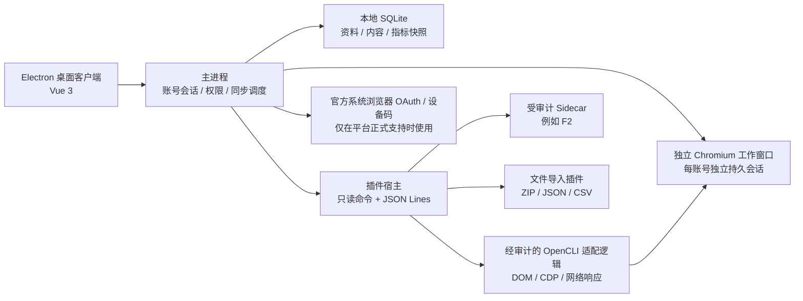

# 个人社媒数据客户端：GitHub 非官方接口调研与设计

> 调研日期：2026-07-12
> 范围：只采集用户本人账号的个人资料、本人发布的内容和内容统计；数据默认只保存在本机；不采用收费 API、收费代理或需要商业采购的数据服务。

## 1. 结论

这个产品可行，但不应该把每个平台的逆向接口直接写进桌面客户端。更稳妥的方案是：

1. 用内置 Chromium 的跨平台桌面应用负责账号登录、分组管理、数据归一化、SQLite 存储和统计展示。
2. 每个账号使用独立、持久化的浏览器会话分区，优先读取创作者后台或本人主页可见数据。
3. 将每个平台做成只读采集插件；插件只能返回标准 JSON，不能直接访问数据库或其他平台的凭证。
4. 把“官方免费 API”“浏览器已登录采集”“文件导入”都视为插件的不同采集方式。
5. 一旦某个平台必须使用收费代理、频繁绕过验证码、伪造设备指纹或破解签名，立即停止该接入路线。

推荐使用 Electron 内置 Chromium 作为账号浏览器，以 [OpenCLI](https://github.com/jackwener/OpenCLI) 的站点适配器和采集策略作为首选参考实现。OpenCLI 采用 Apache-2.0 许可证，支持结构化 JSON/CSV 输出、站点适配器和插件；仓库在 2026-07-03 仍有版本发布。可以移植经过审计的只读适配逻辑，但不能让任意 OpenCLI 插件直接取得桌面应用权限，也不采用其外部浏览器 Cookie 桥作为默认登录方案。

对于 OpenCLI 暂未提供所需字段的平台，可将 [F2](https://github.com/Johnserf-Seed/f2) 作为第二候选。F2 同样采用 Apache-2.0，已覆盖抖音、TikTok、微博和 X/Twitter 的用户资料与用户作品接口，但它需要 Python 运行时并直接使用 Cookie，维护和风控成本更高。

## 2. 调研边界与判断标准

### 2.1 纳入条件

- 能获取本人资料、本人作品列表或创作者统计中的至少一种。
- 免费使用，不强制购买 API 配额、代理池或 SaaS 服务。
- 有明确开源许可证，允许集成或分发；无许可证项目只作为研究资料。
- 能在 Windows、macOS、Linux 上运行，或能移植到内置 Chromium 的跨平台插件宿主。
- 支持只读和低频访问，能够关闭评论、点赞、发布等写操作。

### 2.2 停止条件

- 必须购买代理、验证码服务、第三方数据接口或平台 API 配额。
- 必须绕过验证码、登录保护、付费内容或访问控制。
- 需要持续伪造设备指纹、批量账号养号或高并发请求才能稳定运行。
- 仓库无许可证、禁止商业用途，且计划直接复制或分发其代码。
- 平台或项目已经明确发出侵权通知、律师函或停止维护声明。

“只采集自己的账号”显著降低了隐私和数据所有权风险，但不会自动消除平台服务条款、反自动化规则和接口逆向相关风险。因此所有非官方插件都应标为实验性，并允许平台级远程关闭或本地禁用。

## 3. GitHub 项目调研

### 3.1 首选基础设施

| 项目 | 能力 | 登录方式 | 许可证与状态 | 结论 |
|---|---|---|---|---|
| [jackwener/OpenCLI](https://github.com/jackwener/OpenCLI) | 已登录浏览器桥、DOM 提取、网络响应拦截、JSON/CSV 输出、站点及插件机制；内置小红书、知乎、微博、抖音、X、LinkedIn、Reddit 等适配器 | Chrome/Chromium 扩展连接本机守护进程，按域读取现有 Cookie | Apache-2.0；约 26k stars；2026-07 仍活跃 | **首选适配器参考与代码来源**。只移植固定、已审计的只读解析逻辑；为减少凭证暴露，不启用外部 Browser Bridge 和 Cookie 导入 |
| [Johnserf-Seed/f2](https://github.com/Johnserf-Seed/f2) | 抖音、TikTok、微博、X 的资料、主页作品和媒体元数据；异步分页 | 手动 Cookie 或浏览器 Cookie | Apache-2.0；约 2.5k stars；文档近期仍更新 | **第二候选**。用于 OpenCLI 缺字段的平台，不作为默认登录层 |
| [wechatsync/Wechatsync](https://github.com/wechatsync/Wechatsync) | 利用浏览器登录态进行多平台文章提取和分发 | 浏览器扩展复用 Cookie | GPL-3.0；约 6k stars；活跃 | 适合作为文章提取和浏览器插件设计参考；若复制代码会引入 GPL 义务，不建议作为核心依赖 |

OpenCLI 的浏览器扩展声明只与 `localhost` 守护进程通信，按命令和目标域读取 Cookie，且使用隔离的自动化窗口。该设计很适合本项目，但这是项目方的隐私声明，正式集成前仍需要代码审计和实际网络流量验证。参见其 [隐私说明](https://github.com/jackwener/OpenCLI/blob/main/PRIVACY.md) 和 [插件说明](https://github.com/jackwener/OpenCLI/blob/main/docs/guide/plugins.md)。

### 3.2 中国大陆常见平台

| 平台 | GitHub 候选 | 能拿到的数据 | 主要问题 | 建议 |
|---|---|---|---|---|
| 小红书 | [OpenCLI](https://github.com/jackwener/OpenCLI)、[ReaJason/xhs](https://github.com/ReaJason/xhs)、[xiaohongshu-mcp](https://github.com/xpzouying/xiaohongshu-mcp)、[xiaohongshu-cli](https://github.com/jackwener/xiaohongshu-cli) | 本人资料、本人笔记、单篇笔记详情、创作者统计 | 私有 Web 接口变化快，容易触发验证码或 IP 限制；部分活跃项目无明确许可证 | **可做 P0 实验插件**。优先 OpenCLI 的 `creator-profile`、`creator-notes`、`creator-note-detail`、`creator-stats`，只读、手动触发 |
| 抖音 | [F2](https://github.com/Johnserf-Seed/f2)、[OpenCLI](https://github.com/jackwener/OpenCLI) | 用户资料、主页作品、作品点赞/评论/分享/播放等公开指标 | Cookie 很长且容易失效，接口签名和风控会变化 | **可做 P0 实验插件**。先用 F2 资料与作品接口验证；不接发布、删除、评论 |
| 微博 | [F2](https://github.com/Johnserf-Seed/f2)、[OpenCLI](https://github.com/jackwener/OpenCLI)、[weiboSpider](https://github.com/dataabc/weiboSpider) | 用户资料、本人微博、时间、点赞、评论、转发、媒体链接 | `weiboSpider` 页面未显示明确许可证；Cookie 方案仍有失效风险 | **可做 P0 实验插件**。优先 OpenCLI/F2；不直接集成无许可证项目 |
| 知乎 | [OpenCLI](https://github.com/jackwener/OpenCLI)、[zhihu-download](https://github.com/chenluda/zhihu-download) | 文章/回答正文、标题、时间、链接；可从个人页枚举本人内容 | OpenCLI 现有命令更偏单篇内容，完整“我的创作”可能需新增浏览器适配器 | **P1**。使用已登录页面 DOM 或创作中心可见数据，不逆向移动端接口 |
| 微信公众号 | [OpenCLI](https://github.com/jackwener/OpenCLI)、[Wechatsync](https://github.com/wechatsync/Wechatsync)、[wechat-article-exporter topic](https://github.com/topics/wechat-article) | 已知文章 URL 的标题、正文、作者、日期；创作后台可见本人文章和部分统计 | 个人订阅号的官方 API 权限有限；历史文章枚举和阅读统计通常需要创作后台登录态 | **P1**。先支持文章 URL/导出文件导入，再做创作后台 UI 采集 |
| 快手 | [MediaCrawler](https://github.com/NanmiCoder/MediaCrawler) 等 | 创作者主页和作品 | MediaCrawler 许可证/声明限制为学习研究、禁止商业用途；其他项目维护质量不一 | **暂缓**。只做文件导入或自行实现 UI 适配器 |
| B 站 | 已关停的 [bilibili-API-collect](https://github.com/SocialSisterYi/bilibili-API-collect) 和 [bilibili-api](https://github.com/Nemo2011/bilibili-api) | 原本能获取账号、稿件、统计等 | 前者于 2026-01 收到律师函后归档；后者于 2026-07-06 因类似通知关停 | **明确排除非官方 API**。只考虑官方免费导出、用户手工导入或纯 UI 可见数据 |

补充判断：

- `ReaJason/xhs` 是 MIT 许可证，接口封装清晰，可作为小红书字段映射参考，但核心最近可见提交较旧，不宜成为唯一依赖。
- `xiaohongshu-cli` 功能完整，甚至包含本人笔记和创作者接口，但仓库主页没有显示许可证；在许可证明确前不能复制或分发其代码。
- `xiaohongshu-mcp` 活跃且采用真实浏览器路线，但仓库主页同样未显示许可证，适合作为行为验证样本而不是代码依赖。
- `MediaCrawler` 覆盖面很广，但其声明禁止商业用途且定位为学习研究。即使当前项目是个人使用，也不宜把它作为未来可分发客户端的核心依赖。

### 3.3 海外平台

| 平台 | GitHub 候选 | 结论 |
|---|---|---|
| X/Twitter | [OpenCLI](https://github.com/jackwener/OpenCLI)、[Twikit](https://github.com/d60/twikit)、F2 | 官方 API 已按量收费；非官方方案能使用登录态读取资料和推文。优先 OpenCLI，X 官方归档文件导入作为安全兜底。风险等级高 |
| Instagram | [instagrapi](https://github.com/subzeroid/instagrapi) | MIT、活跃、功能完整，但项目自身明确提示私有 API 在生产中容易遇到 challenge、IP 拦截、代理和账号信任问题。若稳定运行需要收费代理，按本项目规则立即停止。暂不进入 MVP |
| TikTok | [F2](https://github.com/Johnserf-Seed/f2)、[TikTok-Api](https://github.com/davidteather/TikTok-Api) | F2 能获取用户资料与作品；TikTok-Api 明确不支持用户认证路由，只能取登出状态可见数据。列为 P2 实验插件 |
| Facebook | [facebook-scraper](https://github.com/kevinzg/facebook-scraper) | 可用 Cookie 读取公开页面，但 Issue 多、页面结构脆弱，个人资料访问也受限制。优先官方数据导出包，不进入 MVP |
| LinkedIn | [OpenCLI](https://github.com/jackwener/OpenCLI) | OpenCLI 已有 `posts`、`post-analytics`、`profile-read`、`profile-analytics`，技术上可行；账号风控敏感，列为 P2，只允许手动同步 |
| YouTube | [yt-dlp](https://github.com/yt-dlp/yt-dlp) 等 | 没必要优先走非官方接口。YouTube Data API 的默认免费配额和 Google Takeout 足够个人低频统计，可作为“官方免费/导入”插件 |
| Bluesky / Mastodon | 官方开放协议和 API | 无需非官方逆向，直接使用免费公开 API，是低风险插件 |

## 4. 推荐产品架构



### 4.1 桌面层

- **Electron + Vue 3 + TypeScript**：Windows、macOS、Linux 共用 UI，并随应用分发 Chromium；主窗口负责账号管理，账号网页使用独立工作窗口。
- **WebContentsView**：每个账号工作窗口使用固定工具栏和全尺寸远程网页视图；所有远程页面关闭 Node.js 集成、启用上下文隔离和 Chromium 沙箱。
- **持久 Session Partition**：每个账号绑定一个 `persist:social:<account_uuid>` 会话，独立保存 Cookie、缓存、LocalStorage 和 Service Worker。
- **主进程与插件宿主**：负责插件进程管理、访问控制、同步任务、数据校验和 SQLite 事务；远程网页不能直接调用这些能力。
- **SQLite**：单机数据仓库；默认不开云同步，不上传凭证和原始响应。
- **系统钥匙串**：Windows Credential Manager、macOS Keychain、Linux Secret Service。仅在必须手工保存 Cookie/Token 时使用。

这里的“内置”是托管 Chromium，不是系统 WebView。Electron 官方提供持久 session partition，可自然隔离多账号 Cookie 和缓存；`WebContentsView` 放在每账号独立的浏览器工作窗口中，避免主界面狭窄区域、原生视图覆盖弹窗和嵌套滚动问题。代价是安装包和内存占用更大，而且必须跟随 Electron/Chromium 安全版本持续更新。

内置浏览器使用真实 Chromium 渲染和网络栈，但不能表述为“与用户日常使用的 Chrome 完全一样”。Electron 的产品标识、更新节奏、扩展能力、媒体组件和部分浏览器集成功能可能与 Chrome 不同，平台也可能识别出嵌入式浏览器。官方入口登录可以降低钓鱼和凭证泄露风险，但不能保证平台不会因非官方采集、访问频率或嵌入式环境触发验证。因此产品目标是尽量降低风险，而不是承诺零风险。

该模式只实现稳定会话隔离，不实现所谓“防关联”或“反检测”功能：不随机修改 Canvas/WebGL、时区、字体、User-Agent，不自动切换代理，也不绕过验证码。每个账号只是拥有独立、长期一致的正常 Chromium 环境。

### 4.2 采集方式优先级

1. **官方免费 API**：例如 Bluesky、Mastodon、YouTube 免费额度。
2. **平台官方数据导出包**：适合 X、Instagram、Facebook、LinkedIn、YouTube 等，稳定且风险最低。
3. **内置托管 Chromium**：适合小红书、抖音、微博、知乎、微信公众号创作后台。
4. **受控 Sidecar**：只有当内置浏览器适配器缺关键字段时才启用 F2 等库。
5. **公开页面解析**：只读取本人公开主页，能力最弱但不需要保存登录凭证。

### 4.3 内置浏览器的登录与 Cookie

- 登录只能从内置的“添加账号”流程进入插件清单中声明并经人工审核的平台官方登录 URL；地址栏始终显示完整主机名。
- 只允许 `https`。使用 URL 解析后的精确 `origin` 与域名白名单判断，不能使用容易被相似域名绕过的字符串前缀判断。
- 官方 SSO、扫码和登录重定向域名必须逐项加入平台白名单；未知域名、证书错误、混合内容和非预期弹窗默认阻止。
- 用户直接在官方页面完成密码、扫码或验证码登录，客户端不读取账号密码，不自动填写密码，不代做验证码。
- 登录页和认证回调页不注入采集脚本；完成登录、离开认证页面并由用户确认账号后，才允许执行轻量 `whoami`。
- Cookie 由该账号自己的持久 session partition 管理，不需要从外部 Chrome 数据库复制。
- 客户端数据库只记录 session partition 的标识，不保存 Cookie 明文。
- 插件只能操作当前绑定账号的网页会话，不能枚举其他账号分区的 Cookie。
- 如果平台明确禁止嵌入式登录或登录流程不兼容，只允许使用平台支持的系统浏览器 OAuth、设备码或官方扫码流程；没有安全的官方回传方式时标记为“不支持内置登录”。不复制外部浏览器 Cookie，不修改 User-Agent，不伪造指纹绕过限制。

因此默认交互是“从账号详情打开独立浏览器工作窗口，在其中访问平台官方页面并登录”，不是让用户向客户端提交账号密码。为减少凭证暴露面，手工粘贴或导入 Cookie 不进入默认产品能力。

### 4.4 账号安全硬约束

实现基线遵循 Electron 官方的 [安全清单](https://www.electronjs.org/docs/latest/tutorial/security)、[上下文隔离](https://www.electronjs.org/docs/latest/tutorial/context-isolation) 和 [Session Partition](https://www.electronjs.org/docs/latest/api/session) 文档；其中 Electron 官方也明确说明 Electron 是桌面应用框架而不是完整浏览器，安全措施只能降低风险，不能消除风险。

- 远程平台页面设置 `nodeIntegration: false`、`contextIsolation: true`、`sandbox: true`，且不向网页暴露 Electron、文件系统、插件或数据库 API。
- 保持 `webSecurity` 开启，不启用不安全内容、实验性 Blink 能力或任意扩展；站点权限默认拒绝，仅对官方域名按需授权。
- 使用 `will-navigate`、`will-frame-navigate` 和 `setWindowOpenHandler` 校验所有导航、子框架与新窗口目标；外部打开也必须重新校验 URL。
- 证书校验失败时直接中止，不提供“仍然继续”按钮。
- 每个账号的持久会话独立；断开账号时可清除对应 Cookie、缓存、IndexedDB、LocalStorage 和 Service Worker，不影响其他账号。
- Electron/Chromium 跟随受支持稳定版本更新；发现高危安全公告时停止旧版本登录和同步。
- 登录成功不会立即批量采集。首次同步由用户明确触发，并采用小范围、低频、串行请求；401、403、429、验证码或登录墙出现时立即停止。
- 插件永远拿不到密码、完整 Cookie 列表或任意网络权限，只能通过受控会话代理执行声明过的只读操作。

## 5. 自有插件协议

不要直接把 OpenCLI 的任意第三方插件装进主进程。OpenCLI 插件是普通 Node.js/TypeScript 代码，默认具有本机进程权限。本产品应在其外层定义一个更窄的采集协议，并仅允许经过审核、固定版本和固定哈希的适配器。

### 5.1 插件清单

```json
{
  "schemaVersion": 1,
  "id": "xiaohongshu",
  "name": "小红书",
  "version": "0.1.0",
  "license": "Apache-2.0",
  "mode": "managed_browser",
  "readOnly": true,
  "ownedAccountOnly": true,
  "capabilities": [
    "account.profile",
    "content.list",
    "content.metrics",
    "account.metrics"
  ],
  "allowedHosts": [
    "www.xiaohongshu.com",
    "creator.xiaohongshu.com"
  ],
  "minimumIntervalSeconds": 2,
  "recommendedSyncIntervalHours": 24
}
```

### 5.2 插件命令

所有插件通过标准输入/输出交换 JSON Lines，不允许直接连接 SQLite。

| 命令 | 作用 |
|---|---|
| `probe` | 检查依赖、内置浏览器会话和登录状态，不读取内容 |
| `whoami` | 返回当前登录账号的远端 ID，用于绑定“这是我的账号” |
| `profile` | 返回本人资料和账号级指标 |
| `contents` | 以 cursor 分页返回本人作品，支持 `since` 增量同步 |
| `content_metrics` | 批量刷新已知作品的最新指标 |
| `logout` | 删除本插件在系统钥匙串中的凭证引用，不操作平台账号 |

统一响应包：

```json
{
  "ok": true,
  "schemaVersion": 1,
  "requestId": "uuid",
  "data": {},
  "nextCursor": null,
  "warnings": [],
  "rateLimit": {
    "retryAfterSeconds": null
  }
}
```

### 5.3 本人账号约束

首次连接时必须执行以下流程：

1. 内置浏览器中由用户完成登录。
2. 插件调用 `whoami` 返回平台账号 ID、昵称和头像。
3. 客户端展示确认页，由用户确认这是自己的账号。
4. 本地保存 `owner_remote_id`，之后所有内容必须满足 `author_remote_id == owner_remote_id`。
5. 插件不提供关键词搜索、他人主页、粉丝列表和批量评论采集能力。

即使底层开源库支持搜索所有用户，产品插件也不暴露这类接口。

### 5.4 登录账号管理

账号管理是客户端的核心模块，而不只是插件的一次性配置。一个用户可以在同一平台连接多个本人账号，例如两个小红书账号或个人微博与工作微博。

客户端需要提供以下操作：

- **添加账号**：选择平台，客户端创建独立会话分区，用户在内置浏览器中完成登录，再通过 `whoami` 确认账号身份。
- **账号列表**：展示平台、头像、昵称、远端账号 ID、连接时间、最近同步时间和当前登录健康状态。
- **切换账号**：为平台设置默认账号；手工同步和查看统计时可以临时选择其他账号。
- **重命名本地别名**：例如“个人号”“工作号”，不修改平台上的昵称。
- **分组管理**：创建、重命名、排序和删除本地分组；一个账号可以加入多个分组，删除分组不会删除账号或历史数据。
- **账号备注**：为账号填写本地备注，例如负责人、内容方向、登录说明和运营注意事项；备注不上传到社媒平台。
- **标签与筛选**：添加多个短标签，并按平台、分组、标签、状态和关键词组合筛选账号。
- **重新登录**：登录态过期时打开绑定的内置浏览器会话，让用户完成验证；不要求重新创建本地账号。
- **暂停/恢复同步**：保留历史数据和账号绑定，只停止后续访问平台。
- **断开账号**：删除本地凭证引用和同步任务；历史统计由用户选择保留或一并删除。
- **删除本地数据**：按账号删除资料、作品、指标快照和原始调试数据，不影响平台上的账号和内容。

每个连接必须绑定独立的 `(platform, remote_id, session_partition)`。执行采集前再次调用轻量级 `whoami`：如果当前会话登录账号与绑定的 `remote_id` 不同，任务立即停止并提示用户重新确认，不能把新账号数据写入旧账号。

账号状态建议使用：

| 状态 | 含义 | 客户端行为 |
|---|---|---|
| `ready` | 登录有效，账号身份匹配 | 允许同步 |
| `paused` | 用户主动暂停 | 不访问平台，保留本地数据 |
| `expired` | Cookie/Token 失效 | 提示重新登录，不自动重试 |
| `mismatch` | 当前会话账号与绑定账号不同 | 阻止同步，提示重新登录或确认账号 |
| `cooldown` | 触发 429、验证码或平台限制 | 显示恢复时间，期间不发请求 |
| `unsupported` | 插件因平台变化暂时不可用 | 保留历史数据，等待适配器升级 |

账号管理不等于自动化运营。默认版本不会提供代替用户执行发文、删除、点赞、评论、关注等平台写操作；这些能力如果以后需要，应使用单独的写权限插件和逐次确认流程。

账号中心建议采用“分组侧栏 + 账号列表”的布局：侧栏包含“全部账号”“未分组”“登录异常”和用户自定义分组；账号列表支持批量加入/移出分组、批量暂停同步，但批量断开和删除数据仍需逐项确认。备注内容只参与本地搜索，不传给采集插件。

## 6. 数据模型

### 6.1 核心表

| 表 | 关键字段 | 说明 |
|---|---|---|
| `platform_account` | `id`, `platform`, `remote_id`, `username`, `display_name`, `local_alias`, `local_note`, `status`, `connected_at` | 一个本地用户可连接同一平台的多个本人账号；别名和备注仅保存在本地 |
| `account_session` | `account_id`, `session_partition`, `credential_ref`, `last_verified_at`, `expires_at` | 只保存内置 Chromium 会话分区和系统钥匙串引用，不在 SQLite 保存 Cookie |
| `account_group` | `id`, `name`, `color`, `sort_order`, `created_at` | 用户自定义账号分组 |
| `account_group_member` | `group_id`, `account_id`, `sort_order` | 多对多关系，支持一个账号加入多个分组 |
| `account_tag` | `account_id`, `tag` | 本地标签，用于搜索和筛选 |
| `account_snapshot` | `account_id`, `captured_at`, `followers`, `following`, `content_count`, `views_total` | 保留时间序列，不能只覆盖最新值 |
| `content` | `id`, `account_id`, `remote_id`, `type`, `title`, `body_excerpt`, `url`, `published_at` | 以 `(platform, remote_id)` 去重 |
| `content_snapshot` | `content_id`, `captured_at`, `views`, `likes`, `comments`, `shares`, `favorites` | 内容指标随时间变化，需要快照 |
| `sync_cursor` | `account_id`, `plugin_id`, `cursor`, `last_success_at` | 增量同步与断点续传 |
| `plugin_installation` | `plugin_id`, `version`, `source`, `commit_hash`, `enabled`, `risk_level` | 固定插件来源和审计状态 |
| `raw_event` | `plugin_id`, `captured_at`, `payload`, `expires_at` | 仅用于调试，默认 7 天后删除，可关闭 |

### 6.2 内容类型

- `article`：长文、专栏、公众号文章。
- `post`：微博、X、知乎想法等短内容。
- `image`：小红书图文笔记等。
- `video`：抖音、TikTok、YouTube 视频。
- `answer`：知乎回答等问答内容。

### 6.3 指标口径

各平台对播放、阅读、曝光和互动的定义不同，不能直接混成一个数字。UI 应同时保留：

- 原始指标名称和平台来源。
- 归一化指标：`views`、`likes`、`comments`、`shares`、`favorites`。
- 指标可见性：`exact`、`rounded`、`not_available`、`estimated`。
- 互动率口径：默认 `(点赞 + 评论 + 分享 + 收藏) / 浏览量`；没有浏览量时改用粉丝数，并明确标注分母。

跨平台汇总只适合看趋势，不应暗示各平台指标完全可比。

## 7. 同步与风控设计

### 7.1 默认同步策略

- 首次同步：最多拉取最近 100 条本人内容；历史全量由用户手工选择。
- 日常同步：默认每天一次，只拉取新内容并刷新最近 30 条内容的指标。
- 每个平台单并发；请求间隔至少 2 秒，并服从插件更严格的限制。
- 遇到 401/403、验证码或登录墙立即停止，不自动反复登录。
- 遇到 429 使用服务端 `Retry-After`；没有时至少冷却 30 分钟。
- 同一个错误连续三次后自动禁用该平台的定时同步，等待用户手工恢复。

### 7.2 明确禁止

- 不做账号池、代理池、自动换 IP、验证码识别或设备指纹伪造。
- 不采集评论者、粉丝或关注列表的个人信息。
- 不自动点赞、评论、关注、发布或删除内容。
- 不在日志、崩溃报告、命令行参数和数据库明文中记录 Cookie、Token、密码。
- 不把 Cookie 传给社区插件或远程服务。

### 7.3 插件风险分级

| 等级 | 条件 | 默认行为 |
|---|---|---|
| 低 | 官方免费 API、官方导出包、公开协议 | 可定时同步 |
| 中 | 已登录页面 DOM、本人创作后台可见数据 | 默认每日一次，可手动同步 |
| 高 | 私有 Web API、内部 GraphQL、签名参数、直接 Cookie | 默认关闭定时同步，需用户确认 |
| 禁用 | 收费代理、绕验证码、绕访问控制、收到明确侵权通知 | 不提供插件 |

## 8. 平台优先级

### P0：验证产品核心

1. **通用 JSON/CSV/ZIP 导入插件**：先验证数据模型和统计，不受平台变动影响。
2. **小红书**：内置 Chromium + 经审计的 OpenCLI 适配逻辑，采集资料、本人笔记和创作者统计。
3. **微博**：OpenCLI 或 F2，资料、本人微博、互动指标。
4. **抖音**：F2 只读 Sidecar，资料、本人视频和公开统计。

### P1：长文平台

1. **知乎**：本人文章/回答列表和正文。
2. **微信公众号**：已知文章 URL 导入，再扩展到创作后台的本人文章和统计。
3. **X/Twitter**：OpenCLI + 官方归档文件导入兜底。

### P2：风控敏感或收益较低

- Instagram、TikTok、LinkedIn、Facebook、快手。
- 只有在不需要收费代理、不频繁触发验证的前提下才进入开发。

### 暂不支持

- B 站非官方 API：鉴于 2026 年已发生明确的项目关停和律师函事件，不应复用或重新实现相关逆向接口。

## 9. MVP 验收标准

- 用户能明确看到当前连接的是哪个本人账号，并可随时断开。
- 同一平台能够连接多个本人账号，支持本地别名、默认账号、切换、暂停和重新登录。
- 支持自定义分组、一个账号加入多个分组、账号备注、标签、排序和组合筛选。
- 删除分组不得删除账号、登录凭证引用或历史统计；备注和分组信息不得发送给平台插件。
- 每次同步前验证当前浏览器账号身份；出现账号不匹配时不得写入任何数据。
- 不同账号的同步游标、作品、指标快照、Chromium session partition 和凭证引用完全隔离。
- 每个平台插件只能返回绑定账号的资料和作品。
- 重复同步不会产生重复内容；中断后可从 cursor 继续。
- 能展示粉丝、内容数、浏览、互动及 7/30/90 天趋势。
- 能查看每条作品的指标变化，而不只显示最新值。
- 在没有任何收费 API 或代理的情况下完成 P0 全链路。
- Cookie/Token 不出现在 SQLite、日志、崩溃报告和进程参数中。
- 平台要求验证码、代理或额外付费时，客户端能够清楚说明并停止，而不是尝试绕过。

## 10. 最终技术选择

建议采用以下组合：

- 客户端：Electron + Vue 3 + TypeScript，双栏账号管理和每账号独立 Chromium 工作窗口。
- 本地核心：Electron 主进程/隔离工作进程 + SQLite；后续如需更强进程隔离可增加 Rust Sidecar。
- 主采集层：每账号独立持久 Session Partition + 固定版本、固定哈希、只读的 OpenCLI 适配逻辑。
- 备用采集层：独立 Python Sidecar 运行 F2，仅开放审核过的只读函数。
- 插件协议：进程隔离 + JSON Lines + 能力清单 + 域名白名单。
- 凭证：优先留在浏览器；必须保存时进入系统钥匙串。
- 分发策略：首发 Windows/macOS/Linux 桌面端；外部浏览器扩展仅作为兼容性兜底组件。

这个选择比“直接集成一堆爬虫库”更适合长期维护：桌面端的数据模型和统计保持稳定，平台变动只需要更新单个平台适配器；同时可以把高风险适配器单独禁用，而不影响用户已经保存在本地的数据。
