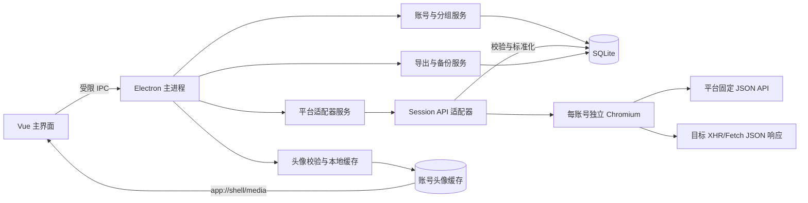
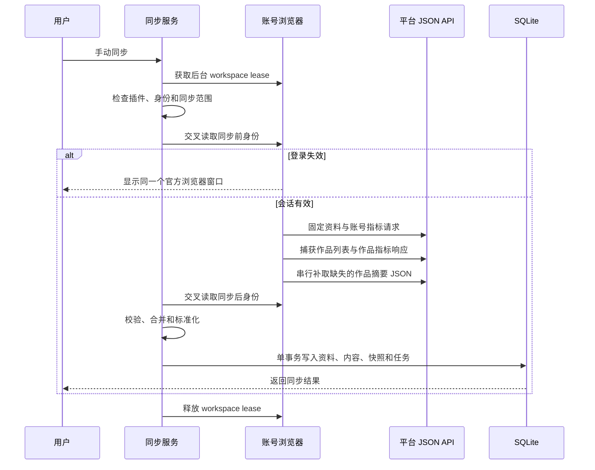

# 归页 Streamfold 调研与总体设计

> 版本：0.4.0
>
> 更新日期：2026-07-14
> 范围：管理用户本人的社媒账号，采集本人资料、本人发布内容和账号可见统计；不采用要求付费或商业审批的官方 API。

## 1. 需求结论

产品需要同时满足以下目标：

- 在一个桌面客户端中管理多个平台、多个本人账号。
- 每个账号保留独立登录会话，支持重新登录、切换、断开和状态检查。
- 支持可选本地备注名、备注、标签、自定义分组、默认账号和暂停同步；备注名留空时在首次身份绑定后采用平台昵称。
- 平台以适配器形式接入，核心数据模型和统计页面不依赖具体平台。
- 数据只来自平台 JSON API 或平台页面自身发起的 JSON 网络响应。
- 不把平台页面 DOM、可见文本或 HTML 当作采集数据源。
- 不提供手动 JSON/CSV 平台数据导入插件；JSON/CSV 只用于导出本地数据。
- 不使用收费 API、收费代理、验证码服务、设备指纹伪造或批量账号自动化。

这些约束决定了客户端不能只是一个网页抓取器，也不能要求用户把 Cookie 粘贴到第三方脚本。账号浏览器、接口白名单、身份核验、标准化数据和本地事务存储必须由应用统一管理。

## 2. GitHub 非官方接口调研

### 2.1 候选项目

| 项目 | 可借鉴内容 | 与本项目的关系 |
|---|---|---|
| [jackwener/OpenCLI](https://github.com/jackwener/OpenCLI) | 已登录浏览器中的平台命令、同源 `fetch`、XHR/Fetch 响应捕获、适配器组织方式 | 首要设计参考。归页只移植经确认的固定 JSON 接口和字段规则，不运行任意 OpenCLI 插件 |
| [ReaJason/xhs](https://github.com/ReaJason/xhs) | 小红书创作者接口路径、请求参数和返回字段 | 用于交叉核对作品管理接口，不作为运行时依赖 |
| [jackwener/xiaohongshu-cli](https://github.com/jackwener/xiaohongshu-cli) | 小红书公开作品详情 `/api/sns/web/v1/feed` 的研究实现 | 公开作品页实测不会自然产生该请求，归页不复制其签名算法或 HTML 回退，运行时改用创作中心本人作品详情 JSON |
| [jzOcb/xhs-note-health-checker](https://github.com/jzOcb/xhs-note-health-checker) | 小红书 v2 作品管理接口与 `data.notes` 响应形状 | 用于确认当前作品列表接口版本和字段候选，不作为运行时依赖 |
| [Johnserf-Seed/f2](https://github.com/Johnserf-Seed/f2) | 抖音、微博等平台的非官方接口封装 | 需要独立 Python 运行时和 Cookie 输入，当前不进入核心架构 |

### 2.2 OpenCLI 结论

OpenCLI 证明了一个关键方向：在已经登录的平台页面环境中，可以调用创作后台 JSON API，或者观察页面本身发起的签名 XHR/Fetch 请求，从而获得结构化数据。它比复制外部浏览器 Cookie 后再用独立 HTTP 客户端更接近平台页面的实际请求语义。

但归页不直接嵌入 OpenCLI 的通用插件运行时，原因是：

- 通用 Node.js 插件权限大于本产品需要的权限。
- OpenCLI 的部分适配器包含页面 DOM 回退，而本产品要求 API-only。
- 本产品需要每账号 Session 隔离、身份绑定、事务提交和桌面 UI 状态，这些边界与命令行工具不同。

因此当前做法是以 OpenCLI 的接口行为为参考，在归页内实现窄化的 `session_api` 适配器：固定主机、固定路径、固定能力、固定字段校验，不暴露任意请求或页面脚本入口。

### 2.3 小红书可行性

本地调研与测试账号验证确认了以下创作中心接口：

| 数据 | 接口 | 获取方式 |
|---|---|---|
| 登录用户资料 | `GET /api/galaxy/user/info` | 在已登录创作中心页面同源请求固定接口，读取 `redId`、`userName`、`userAvatar`、`userDesc` |
| 创作中心资料 | `GET /api/galaxy/creator/home/personal_info` | 在已登录创作中心页面同源请求固定接口，读取账号 ID、资料、关注、粉丝和累计获赞与收藏，并与 `user/info` 交叉校验身份 |
| 账号指标 | `GET /api/galaxy/creator/data/note_detail_new` | 在已登录创作中心页面同源请求固定接口 |
| 本人作品列表 | `/api/galaxy/v2/creator/note/user/posted`，兼容旧路径 `/api/galaxy/creator/note/user/posted` | 打开作品管理页并捕获目标 JSON 响应 |
| 作品指标 | `/api/galaxy/creator/datacenter/note/analyze/list` | 打开数据分析页并捕获目标 JSON 响应 |
| 作品正文摘要 | `GET https://edith.xiaohongshu.com/web_api/sns/capa/postgw/note/detail` | 只为缺少摘要的本人作品打开创作中心 `/publish/update` 路由，捕获页面自身发出的精确 GET JSON，校验 `data.id` 后读取 `data.desc` |

作品管理接口提供完整的本人作品集合，数据分析接口提供当前分析范围内可见的指标。客户端按作品 ID 合并两类结果：作品管理结果作为内容基线，数据分析结果补充浏览、点赞、收藏、评论和分享等指标。没有返回的指标保留为空值。摘要优先取列表或分析 JSON 的 `desc`；缺失时每次最多串行补取 10 条，相邻请求至少间隔 2 秒，已保存摘要不重复请求。2026-07-14 已用登录测试账号在线验证 8 条作品，其中 6 条详情返回并落库非空 `data.desc`，另 2 条平台返回的 `desc` 本身为空。

### 2.4 知乎可行性

OpenCLI 的 [知乎适配器](https://github.com/jackwener/OpenCLI/tree/main/clis/zhihu) 和 [PR #1986](https://github.com/jackwener/OpenCLI/pull/1986) 已验证登录会话下的本人资料、回答、文章和想法 `/api/v4` JSON 接口。已登录本人账号进一步验证了创作中心“内容管理”的统一列表 `/api/v4/creators/creations/v2/all`：它能在同一分页流中返回本人回答和文章，以及创作者自己可见的阅读、赞同、评论和收藏指标。归页不依赖 OpenCLI 的扩展、Bridge 或通用运行时，只在账号自己的知乎页面上下文内执行固定同源 `GET` 请求。

当前实现使用 `/api/v4/me` 取得稳定身份 ID 和本次 `url_token`，再读取公开本人资料。本人内容从创作中心统一列表分页，取同步范围要求的最近 20 或 100 条；公开的回答、文章和想法成员列表只保留严格解析器作为研究参考，当前不作为静默降级源。创作中心列表的 `paging.next`、`is_end`、`totals` 和 `totals_real` 与实际页数交叉校验；已登录测试账号可完整读取 32 条（26 篇文章、6 条回答）。回答和文章使用带类型命名空间的远端键，并保存与远端键严格对应的官方原帖地址。粉丝与关注只同步数量，不同步第三方用户明细。

创作中心响应中的 `reaction.read_count`、`vote_up_count`、`comment_count` 和 `collect_count` 分别映射为浏览、赞同、评论和收藏，字段缺失时保持 `null`。完整正文、收藏夹、粉丝/关注明细和页面内容都不在核心采集范围；后续能力仍须先确认固定 JSON 接口，不能使用页面 DOM 回退。

### 2.5 其他平台结论

微博和抖音可以复用相同的账号浏览器与适配器合同，但不能仅凭开源项目存在就宣称支持。每个平台都需要完成：

1. 测试账号登录与官方域名清单验收。
2. 身份、资料、本人内容和指标 JSON 接口确认。
3. 登录失效、身份切换、限流和响应变更测试。
4. 字段标准化和平台指标口径说明。

在这些条件完成前，适配器只以“计划中”展示，不能启用。必须依赖付费 API、代理或页面 DOM 才能工作的路线不进入实现。

## 3. 总体架构



### 3.1 进程边界

- **Renderer**：Vue 3 页面，只通过 preload 暴露的业务方法访问主进程。
- **主进程**：账号、浏览器、插件、同步任务、SQLite、导出和备份的唯一协调者。
- **资料媒体服务**：校验平台头像 URL、HTTPS/CDN 来源、响应 MIME、文件头和大小，按内容哈希缓存并通过受控同源路由读取。
- **账号浏览器工具栏**：本地 `app://browser` 页面，使用单独的受限 preload。
- **远程平台页面**：运行在 `WebContentsView` 中，不加载业务 preload，不能访问 IPC、数据库或文件系统。
- **SQLite**：存储账号元数据、分组、内容、指标快照、插件状态、任务和设置。

当前没有 Python/Rust Sidecar，也没有任意第三方插件进程。平台适配器由内置、版本化的 TypeScript 实现注册。

## 4. 内置浏览器设计

### 4.1 为什么采用内置 Chromium

用户需要在客户端内管理本人账号，登录态又必须保持隔离。Electron 的持久 Session Partition 可以直接为每个账号提供独立 Cookie、缓存、LocalStorage、IndexedDB 和 Service Worker 存储，而不需要读取外部 Chrome 数据库或要求用户复制 Cookie。

平台页面放在独立大窗口中，解决了主界面嵌入浏览器时宽度不足、嵌套滚动、原生视图覆盖弹层和无法最大化的问题。应用保留一个账号对应一个窗口；重复打开时聚焦已有窗口。

用户主动执行身份核验或同步时不需要先打开窗口。主进程为账号获取隐藏 workspace lease：已有 workspace 直接复用，没有时在后台创建并准备创作中心同源环境；最后一个 lease 释放后销毁仅为后台操作创建的 workspace。若接口返回登录失效，当前 workspace 会提升为同一个可见官方浏览器窗口，并保留原 Session 供用户完成登录。这个受控生命周期和同平台单并发策略也是后续串行批量同步队列的基础。

### 4.2 账号会话

每个账号绑定：

```text
persist:social:<account_uuid>
```

Session Partition 在账号创建时生成并写入账号记录。关闭浏览器窗口不会清除会话；断开账号时只清理该账号 Partition，不影响其他账号。加密数据库备份不包含 Chromium Session，因此恢复后需要重新核验登录身份。

### 4.3 窗口与导航

- 工具栏窗口显示账号、平台、后退、前进、刷新、主页、当前主机和关闭操作。
- 远程页面关闭 Node 集成，启用上下文隔离和沙箱。
- 主进程按平台清单校验顶层 HTTPS 导航、顶层重定向和弹窗目标；平台自身的验证子框架仍受 Chromium 同源策略、CSP 与沙箱约束，不获得任何本地能力。
- 下载和站点权限默认拒绝。
- 平台页面没有主进程 IPC，也不能访问其他账号会话。

内置 Chromium 是普通 Electron/Chromium 运行环境，不实现代理轮换、Canvas/WebGL 修改或验证码处理，也不伪造设备与浏览器版本。对于拒绝 Electron 包装器标识的官方登录页，客户端只移除 User-Agent 中额外的 Electron 与应用产品段，系统和 Chromium 版本始终来自实际运行时。官方入口登录可以减少误入非官方页面的风险，但不能保证平台永远不触发重新验证。

## 5. API-only 采集设计

### 5.1 两种 JSON 传输

`session_api` 适配器只有两种传输方式：

1. **同源固定请求**：后台 workspace lease 确保浏览器位于允许的创作中心 HTTPS 页面，再用页面原生 `fetch` 请求白名单中的固定 `GET` 接口，携带该账号 Session 的登录语义。
2. **页面响应捕获**：对于必须由平台页面生成请求上下文的接口，先连接 Chromium DevTools Protocol 的 `Network` 域，再打开固定业务路由，只读取匹配白名单主机、路径、查询键和请求方法的 Fetch/XHR JSON 响应正文。

第二种方式不自行计算签名，也不读取请求 Cookie。页面按正常逻辑发起请求，客户端只读取目标接口返回的结构化响应。

### 5.2 白名单与响应校验

每个请求或捕获结果都必须通过：

- `https:` 协议、精确官方主机、精确路径校验。
- HTTP 状态码和 JSON Content-Type 校验。
- 单响应大小、累计捕获大小和请求超时限制。
- JSON envelope、ID、字符串长度、时间戳、计数和枚举校验。
- 内容 ID 去重、最大条数和分页完整性校验。

任一条件失败时返回结构化错误，不提交部分数据。接口要求签名、响应变更或没有捕获到完整 JSON 时，不启用 DOM 或文件导入回退。

头像是资料媒体，不交给 Renderer 直接下载。头像必须属于对应平台审核过的 HTTPS 图片主机；小红书与知乎来源分属不同域名族，重定向不得跨族。主进程下载时不带账号凭据或 Referrer，对重定向逐次复验，仅接受 JPEG、PNG、WebP、GIF 或 AVIF，并同时校验 MIME、文件头、Content-Length、实际长度和 512 KiB 上限。缓存键由 SHA-256 内容哈希生成，界面只读取 `app://shell/media/avatars/...`。

### 5.3 身份约束

账号首次连接时执行：

1. 用户点击核验；后台 workspace lease 自动复用账号 Session，尚未登录时才显示官方浏览器窗口。
2. 适配器读取平台固定身份与资料接口；小红书交叉校验 `user/info` 与 `personal_info`，知乎交叉校验 `/api/v4/me` 与本人资料响应。
3. 用户确认这是自己的账号。
4. 适配器再次读取并校验当前身份，结果一致后写入稳定 `remote_id`；本地备注名未自定义时采用平台昵称。
5. 此后每次同步前后都读取身份，任何不一致都终止整次事务。

首次确认令牌有效期为 5 分钟。账号身份、连接状态和同步授权分别存储，避免仅凭“页面已打开”就执行同步。

### 5.4 同步与提交

同步流程为：



- 支持 `profile_only`、`recent_20`、`recent_100` 和 `disabled`。
- 同账号 API 操作互斥，同平台一次只运行一个同步任务。
- 身份核验和同步按适配器最小间隔限频；小红书当前为 60 秒，知乎同步为 300 秒。
- 内容按 `(account_id, remote_id)` 去重，指标以时间快照保存。
- 正文摘要只保存 API `desc` 的标准化前 500 个 Unicode 字符；普通详情补全失败不覆盖已有摘要，401/403 或 429/461/471 则停止整个任务。
- 身份变化、登录过期、响应不完整或数据库提交失败时，不保留半次同步结果。

## 6. 平台插件合同

当前插件不是可执行任意代码的社区插件，而是内置注册表中的平台适配器定义。清单的核心字段为：

```json
{
  "schemaVersion": 1,
  "id": "xiaohongshu-session-api",
  "mode": "session_api",
  "readOnly": true,
  "ownedAccountOnly": true,
  "capabilities": [
    "account.identity",
    "account.profile",
    "account.metrics",
    "content.list",
    "content.metrics"
  ],
  "allowedHosts": ["creator.xiaohongshu.com"],
  "minimumIntervalSeconds": 60,
  "recommendedSyncIntervalHours": 24,
  "riskLevel": "high"
}
```

插件中心只允许启停 `availability = available` 的适配器。计划中适配器可以展示清单和能力，但不能执行。适配器不能直接接收任意 URL、任意 JavaScript、文件输入或原始 Cookie。

新增平台适配器需要：

1. 在平台注册表增加清单。
2. 实现固定 JSON 传输与平台字段解析。
3. 实现身份核验和标准化映射。
4. 增加传输白名单、异常响应、身份变化和数据库事务测试。
5. 用本人测试账号完成真实环境验收后将状态改为可用。

## 7. 数据模型

当前 SQLite schema 版本为 v8。

| 表 | 作用 |
|---|---|
| `accounts` | 平台、可选本地备注名及 `alias_customized`、平台 ID/昵称、头像缓存键与 MIME、简介、创作等级、连接/归属/同步状态、备注、标签、Session Partition 和同步范围 |
| `groups` / `account_groups` | 自定义分组、排序和账号多对多关系 |
| `account_snapshots` | 粉丝、关注、内容数、浏览、互动和累计获赞收藏等账号时间快照 |
| `contents` | 本人内容主记录，以账号和远端 ID 去重，包含类型、标题、正文摘要、官方链接、时间、标签和备注 |
| `content_snapshots` | 浏览、点赞、评论、分享、收藏等内容指标快照 |
| `plugin_installations` | 平台适配器清单、启停、运行次数和最近错误 |
| `jobs` | 同步任务的状态、进度、结果和错误 |
| `sync_cursors` | 为后续分页和增量同步预留的游标 |
| `app_settings` | 导出、备份、恢复和应用设置时间 |

`import_batches` 是旧数据库升级路径保留的兼容表。当前代码没有文件解析服务、导入 IPC、导入插件或界面入口，新同步只通过平台 API 服务提交。

## 8. 账号与内容管理

### 8.1 账号

- 同一平台可添加多个本人账号，每个账号有独立 Session。
- 本地备注名、备注、标签、自定义分组和默认账号不写回平台；备注名留空时首次绑定采用平台昵称，用户自定义后同步不会覆盖。
- 账号列表与详情展示平台头像、昵称和账号 ID；详情读取最新账号快照展示关注、粉丝和累计获赞与收藏，资料字段与时间快照各自保持清晰边界。
- 支持按平台、分组、状态和关键词筛选，以及批量分组和暂停。
- 断开会话、清空历史和删除账号是三个不同操作。

### 8.2 内容与指标

- 统一内容类型：`article`、`post`、`image`、`video`、`answer`。
- 保留平台返回的内容 ID、标题、链接、发布时间和指标可用性。
- 平台未提供的指标为 `null`，不会从页面文本推断。
- 内容详情展示最新快照、上次快照和变化量，并支持本地备注与标签。
- 跨平台汇总用于趋势观察，不假定各平台的浏览和互动口径完全一致。

## 9. 导出与备份

### 9.1 导出

- JSON 导出本地账号、内容和指标快照的结构化数据。
- CSV 导出内容列表，包含公式前缀中和与字段转义。
- 支持全部账号或单账号导出。
- 导出不包含 Chromium Session，也不是重新导入平台数据的入口。

### 9.2 加密备份

- `.svbackup` 保存完整 SQLite 数据库。
- 使用 AES-256-GCM、scrypt、随机 salt/IV、AAD 元数据绑定和 SHA-256 完整性校验。
- 恢复前在临时文件校验格式、schema、数据库完整性和外键。
- 恢复失败时保留现有数据库；恢复成功后关闭账号浏览器、暂停同步并要求重新核验身份。
- Chromium 登录 Session 不进入备份。

## 10. 风险与停止条件

使用官方登录入口和本人账号并不等于平台会认可非官方接口访问。平台可能改变接口、要求重新验证或限制频率。当前设计通过低频、手动触发、单并发和严格停止条件降低风险，但不承诺账号风险为零。

出现以下情况时停止当前同步：

- HTTP 401/403、登录失效或身份不匹配。
- HTTP 429、明确的冷却提示或平台验证页面。
- 接口主机、路径、Content-Type 或 JSON 结构发生变化。
- 作品列表捕获不完整、内容 ID 重复或响应超过大小上限。
- 接入必须依赖付费 API、收费代理、验证码服务或绕过访问控制。

产品只执行本人数据读取，不提供发布、删除、评论、点赞、关注、私信、粉丝采集或账号池操作。

## 11. 当前实现与路线图

### 已实现

- Electron + Vue 3 + TypeScript 桌面外壳和 SQLite v8。
- 多平台账号空间、分组、标签、备注、默认账号和批量管理。
- 每账号独立 Chromium 工作窗口及持久 Session Partition。
- 小红书双接口身份交叉校验、头像本地缓存、资料、账号指标、本人作品列表、正文摘要和作品指标同步。
- 知乎稳定身份核验、头像本地缓存、本人资料、创作中心回答/文章、账号与内容指标快照及原帖链接。
- 无需预开窗口的一键主动同步，以及登录失效时提升同一官方浏览器窗口的后台 workspace lease。
- 内容中心、账号统计、工作台、插件中心和设置页。
- JSON/CSV 导出、按账号清空历史、加密备份与恢复。

### 下一阶段

1. 完成小红书真实多页大账号、限流、登录失效、账号切换和空数据的更多在线环境测试。
2. 增加定时同步、Retry-After 冷却和连续失败熔断。
3. 完成知乎已登录测试账号的在线响应、空列表、多页、登录失效、限流和身份切换验收。
4. 按相同合同接入微博和抖音，每个平台独立验收后启用。
5. 完成 Windows、macOS、Linux 安装包、签名、自动更新和 CI 发布。
6. 在后台 workspace lease、账号互斥和同平台单并发基础上实现串行批量同步队列。

最终技术选择保持为：Electron 内置 Chromium 负责登录会话与平台 JSON 请求，主进程内置 `session_api` 适配器负责白名单、校验和标准化，SQLite 负责本地事务与时间快照，Vue 界面负责账号管理和统计展示。平台变化只需更新对应适配器，不改变账号、内容、分析、导出和备份核心。
