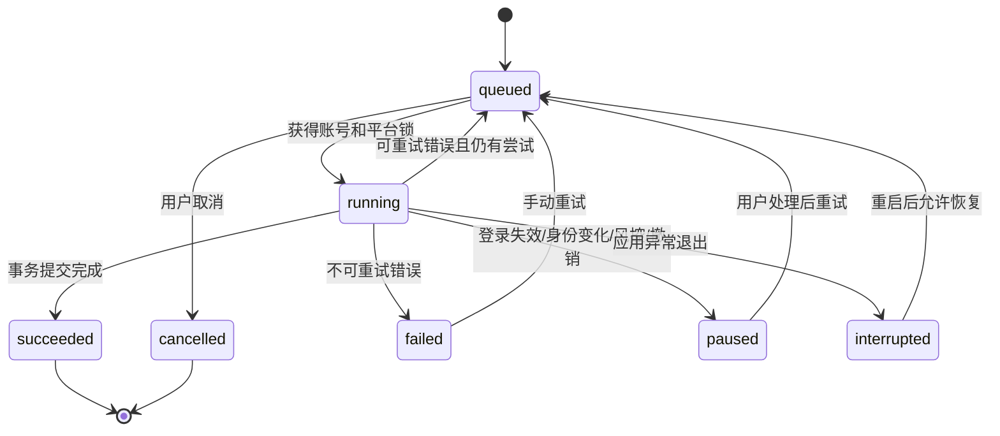

# 产品路线图与实施规划

> 基线版本：归页 Streamfold `0.6.3`
>
> 文档性质：已完成里程碑与后续版本的产品、工程规划。当前事实以共享合同、数据库迁移、测试和[运行架构](architecture.md)为准。

本文把后续功能建议整理为可执行路线图，覆盖产品目标、功能边界、数据与 IPC 演进、界面信息架构、测试策略和发布门槛。开放插件的现行合同见[开放插件系统](plugin-system.md)，平台端点和已知限制见[平台适配器](platform-adapters.md)。

## 1. 总体目标

归页的长期目标不是成为代发、营销或平台自动操作工具，而是成为本地优先的个人社媒数据工作台：

1. 可靠管理本人在多个平台的账号、独立登录 Session、内容和统计快照。
2. 在 Session 有效时完成后台只读同步；只有登录失效、身份变化或平台要求交互时才打开账号浏览器。
3. 用统一任务系统承载单账号同步、分组批量同步、插件动作、事件投递和定时任务。
4. 保留平台原始指标语义，同时提供可解释的跨账号、跨平台趋势分析。
5. 允许签名插件在不修改主程序的前提下增加平台适配器和自动化能力，但不扩大核心数据写入和平台写操作权限。
6. 在正式发布前完成安装包签名、在线更新、迁移回滚和安全验收。

### 1.1 继续坚持的原则

- 只处理用户本人账号及其可见数据。
- 使用平台官方入口登录，不读取密码和验证码。
- 只接受固定 HTTPS JSON API 或精确匹配的 Fetch/XHR JSON 响应，不解析页面 DOM/HTML。
- 每个账号使用独立 Chromium Session Partition，不接受手动 Cookie、请求头或 Session 导入。
- 主进程独占数据库、文件、Session、更新和插件包；Renderer 只获得固定业务接口。
- 第三方插件默认无权限，按贡献点、账号、分组、字段和网络 origin 精细授权。
- 缺失指标使用 `null`，不把“平台未提供”显示成真实的 `0`。
- 所有后台执行都可观察、可暂停、可重试，并在提交业务事务前保持无部分写入。

### 1.2 默认不进入路线图的能力

- 自动发帖、评论、点赞、关注、私信或删除平台内容。
- 绕过登录、验证码、平台安全提示、风控或访问限制。
- 指纹伪装、批量养号、代理池和反检测功能。
- 第三方插件自定义 HTML/Vue 页面、任意 Node/Electron API 或核心业务数据写入。
- 任意 URL、Cookie、请求头、请求正文或脚本执行入口。
- 未经用户明确选择的云同步、遥测和远程日志上传。

## 2. 当前基线

`0.6.0` 已经建立后续版本所需的主要基础设施：

| 能力 | 当前状态 | 后续关注点 |
|---|---|---|
| 账号与 Session | 多平台、多账号、独立 Partition、官方入口登录、账号级任务互斥 | 登录失效长时间运行验收、窗口位置恢复 |
| 平台同步 | 小红书和知乎本人资料、内容、指标 | 异常场景、更多分页、第三个平台 |
| 内容与统计 | 内容中心、原帖链接、动态指标定义与快照历史、基础趋势 | 全文搜索、指标派生、分组和跨平台分析 |
| 任务 | 统一读模型、账号/分组批量队列、任务中心、托盘摘要、取消/重试和恢复 | 真实多账号长时间运行、更多自动同步策略 |
| 自动计划 | 插件计划可创建、启停和删除 | 编辑、预览、重复检测、执行历史 |
| 插件系统 | Manifest v2、QuickJS、授权、目录、更新、Webhook、SDK | 正式目录仓库、SDK 发布、诊断和生态验收 |
| 数据安全 | SQLite 事务、加密备份、IPC 校验、沙箱限制 | 迁移回滚演练、代码签名、安全专项审计 |
| 发布 | 三平台构建和 GitHub Release 工作流 | 正式签名、公证、首次公开 Release、在线更新实测 |

`JobRecord` 继续只持久化账号 `managed_sync`，插件运行使用独立的 `PluginRunRecord`；`TaskQueryService` 已在主进程建立统一只读模型。该分层经过 0.6.0 实现后保留，不为界面统一重写两套稳定数据表。

## 3. 版本路线总览

| 版本 | 主题 | 交付重点 | 前置条件 |
|---|---|---|---|
| `0.5.1` | 稳定性收口 | 弹窗、IPC 普通数据边界、界面回归和更新源基础 | 已并入后续开发 |
| `0.6.0` | 任务中心与批量同步 | 账号/分组批量同步、统一队列、托盘进度 | 已实现，待真实多账号发布验收 |
| `0.6.1` | 小红书完整作品指标 | 10 项列表指标、目标范围完整分页、动态指标历史 | `0.6.0` 数据与任务基础 |
| `0.6.2` | 知乎创作指标 | 账号周期历史、内容动态指标、想法与视频 | `0.6.1` 动态指标模型 |
| `0.6.3` | 知乎同步兼容修复 | 内容 token、数字 ID 与平铺互动指标响应兼容 | `0.6.2` 真实响应验收 |
| `0.7.0` | 内容与数据分析 | FTS5、指标增量、内容趋势、跨账号比较 | 批量同步可稳定产生连续快照 |
| `0.8.0` | 插件生态与平台扩展 | 正式目录、SDK 发布、插件诊断、第三平台 | 目录签名基础设施和审核流程就绪 |
| `0.9.0` | 发布与安全强化 | 代码签名、更新实测、迁移回滚、安全审计 | 功能范围冻结、候选发布仓库确定 |
| `1.0.0` | 稳定发布 | 兼容承诺、完整安装升级链路、正式文档 | 所有发布门槛通过 |

版本号表示功能边界，不承诺日历日期。每个里程碑只有在验收标准全部通过后才能提升下一版本。

## 4. `0.5.1`：稳定性收口

### 4.1 运行计划编辑

当前计划支持创建、启停和删除。稳定版需要补充：

- 编辑账号范围、分组范围和运行间隔。
- 修改启用状态时重新计算 `nextRunAt`，但不立即执行。
- 创建或保存前展示最终覆盖的账号数量和首次预计运行时间。
- 检测同一贡献点、相同范围和相同间隔的重复计划。
- 计划因登录失效、身份变化、插件撤销或连续失败暂停时，显示结构化原因和恢复入口。
- “立即试运行”创建独立手动运行记录，不改变原计划的下次执行时间。

建议新增固定业务接口：

```ts
plugins.previewSchedule(input)
plugins.updateSchedule(input)
plugins.runScheduleNow(scheduleId)
```

接口名称在实现时写入共享合同；Renderer 不直接计算权限范围、最短间隔或下次运行时间。

### 4.2 弹窗与表单基础能力

- 所有应用弹窗支持 `Esc`、焦点锁定和关闭后恢复触发按钮焦点。
- 保存期间禁止关闭；存在未保存表单时给出应用内确认。
- checkbox、radio、switch、文本输入和 Secret 输入继续使用统一尺寸、焦点和禁用样式。
- 窄窗口和最小窗口高度下，弹窗头部、页签、错误区和底部操作保持可见，正文独立滚动。
- 所有错误使用面向操作的说明，并保留可复制的稳定错误代码；不展示文件路径、响应正文或 Electron 实现细节。

### 4.3 更新与发布源验收

- 在测试仓库发布两个连续版本，完整验证检查、下载、用户确认、重启安装和数据保留。
- 验证 Windows NSIS、macOS ZIP 更新和 Linux AppImage 边界；不支持的格式继续显示明确状态。
- 验证更新中断、校验失败、资源缺失、旧版重启和业务维护锁。
- 确认首个包含更新器的版本仍需手动安装，不在界面中暗示开发版或目录构建可在线更新。

### 4.4 验收标准

- 计划可编辑且权限、最短间隔、重复计划和暂停原因均由主进程验证。
- 键盘只使用 Tab、Shift+Tab、Enter、Space 和 Esc 即可完成插件配置与计划管理。
- Electron 回归覆盖计划编辑、未保存确认、焦点恢复和最小窗口布局。
- 两个真实安装版本完成一次在线更新，账号、内容、快照、插件状态和设置保持不变。

## 5. `0.6.0`：任务中心与批量同步

状态：代码、数据库 v11、IPC、Renderer、托盘和自动化回归已完成。发布前仍需用真实本人账号执行多账号长时间运行、登录失效和风控场景验收。

本版本把账号同步、插件运行、事件投递和定时计划呈现为统一、可观察的后台工作流。

### 5.1 用户流程

#### 从账号页发起

1. 用户选择一个或多个账号，或直接选择一个分组。
2. 应用预览实际账号、平台、当前同步状态和可能需要重新登录的账号。
3. 用户选择同步范围：资料、内容、指标，或使用账号保存的默认范围。
4. 主进程创建一批独立账号任务，并返回批次 ID。
5. 任务中心实时显示排队、核验、采集、提交和完成状态。
6. Session 有效时不打开浏览器；只有登录失效或需要用户交互时才提供“打开账号浏览器”。

#### 从任务中心处理失败

1. 用户按状态、平台、账号、触发来源和时间筛选。
2. 失败任务显示稳定错误类别、可执行建议和最后阶段。
3. 登录失效任务可批量暂停，但必须逐账号完成官方入口登录和身份复验。
4. 可重试错误创建新尝试记录；原运行记录不可覆盖。

### 5.2 信息架构

左侧导航新增“任务”，包含：

- 顶部汇总：排队、运行中、需要处理、今日完成。
- 当前任务：按创建时间排列，显示平台、账号、阶段、进度和触发来源。
- 批次视图：显示一次批量操作包含多少账号、成功数、失败数和剩余数。
- 运行历史：统一查看账号同步和插件运行；高级详情仍可跳转插件中心。
- 自动计划入口：跳转到对应贡献点的计划管理，不在任务中心复制配置表单。

托盘菜单增加：

- 当前运行数量和排队数量。
- 打开任务中心。
- 暂停新的自动任务或恢复调度。
- 最近失败摘要；不在系统通知中展示敏感内容标题和账号资料。

### 5.3 统一任务读模型

先保留现有 `JobRecord`、`PluginRunRecord`、事件投递和计划表，主进程增加只读聚合模型：

```ts
interface TaskView {
  id: string
  batchId: string | null
  kind: 'account.sync' | 'plugin.action' | 'plugin.event' | 'plugin.schedule'
  trigger: 'manual' | 'scheduled' | 'event' | 'retry'
  status: 'queued' | 'running' | 'succeeded' | 'failed' | 'cancelled' | 'interrupted' | 'paused'
  accountId: string | null
  pluginId: string | null
  contributionId: string | null
  progress: number | null
  stage: string
  attempt: number
  errorCode: string
  errorMessage: string
  createdAt: string
  startedAt: string | null
  finishedAt: string | null
  nextAttemptAt: string | null
}
```

该模型用于 IPC 和界面，不要求现有表立即合并。只有在两个版本的运行数据证明查询、清理和恢复逻辑重复成本明显高于迁移风险时，才考虑持久化层收敛。

建议新增：

```ts
tasks.summary(query)
tasks.list(query)
tasks.get(id)
tasks.cancel(id)
tasks.retry(id)
tasks.listBatch(batchId)
accounts.enqueueSyncBatch(input)
```

所有分页、筛选、取消和重试都由主进程校验。Renderer 不获得内部队列、数据库对象或插件运行上下文。

### 5.4 状态机与恢复



约束：

- 业务事务开始提交后不提供强制取消，避免部分写入；界面显示“正在提交”。
- 应用启动时，残留的 `running` 转为 `interrupted`，再按错误类型决定是否排回队列。
- 错过多个自动周期只补一次；手动批次不会因为应用重启重复创建。
- 批次使用稳定 ID，账号任务分别记录结果，一个账号失败不回滚其他已完成账号。

### 5.5 并发和限频

| 维度 | 规则 |
|---|---|
| 同一账号 | 始终互斥，账号同步与需要该 Session 的插件任务不能并发 |
| 同一平台适配器 | 默认串行，适配器可声明更严格间隔但不能放宽宿主底线 |
| 不同平台 | 在 CPU、网络和 Utility Process 上限内并行 |
| 手动与自动 | 手动任务优先于尚未开始的自动任务，不中断正在提交的任务 |
| 登录失效 | 暂停该账号的后续自动任务，不影响其他账号 |
| 风控响应 | 暂停对应账号或适配器队列，禁止快速自动重试 |
| 连续失败 | 三次后熔断自动触发，保留手动诊断与试运行 |

### 5.6 验收标准

- 可对至少一个分组发起批量同步，并在应用重启后继续显示准确状态。
- Session 有效的批量同步不弹出账号浏览器。
- 同账号没有并发请求，同适配器符合串行和最小间隔规则。
- 取消排队任务不会留下运行记录或部分数据；提交阶段不会被强制中断。
- 登录失效只暂停对应账号，并提供官方入口登录和重新核验路径。
- 托盘、任务中心、账号页和插件运行记录对同一任务显示一致状态。
- Electron 回归覆盖批次创建、状态筛选、重试、暂停、重启恢复和最小窗口。

### 5.7 `0.6.1` 增量交付

- 小红书作品分析列表保存曝光、观看、封面点击率、点赞、评论、收藏、涨粉、分享、人均观看时长和弹幕。
- 作品分析在本人账号的官方页面上下文中执行固定 JSON 分页；目标范围不完整时拒绝整个同步提交。
- SQLite v12 采用“原五列兼容 + 平台指标定义 + 快照扩展值”模型，新增平台指标不再继续修改固定内容列。
- 内容详情按声明顺序显示指标，并允许切换任意有数据的指标查看变化历史；旧快照缺失值保持未知。
- JSON 与 CSV 导出携带扩展指标，完整指标集合参与快照去重。

### 5.8 `0.6.2` 增量交付

- 知乎使用创作中心固定 HTTPS JSON GET，同步前后通过 `/api/v4/me` 复验本人稳定身份。
- 账号指标保存近 7/14/30 天、累计汇总和最近 30 天每日趋势；SQLite v13 支持指标定义、平台状态、缺失值、同周期修订及可为负的关注者转化。
- 内容同步覆盖回答、文章、想法和视频，通过按内容类型分页的分析列表合并曝光、阅读/播放、赞同、喜欢、互动和完成率等动态指标，避免逐篇 N+1 请求。
- 账号详情提供周期切换、每日趋势、零轴和高级指标不可用状态；内容界面区分知乎“赞同”与“喜欢”。
- JSON 导出升级为 schema v3 并包含账号周期指标历史；所有资料、内容、指标和成功任务继续在同一事务内提交。

### 5.9 `0.6.3` 增量交付

- 内容分析列表优先使用顶层官方 `content_token`，不再被嵌套内容 ID 覆盖。
- 响应中的非负安全整数 token/ID 统一为字符串参与关联和去重；负数、小数、不安全整数及非法字符继续终止同步。
- 平铺数值 `reaction` 作为互动指标解析，只有对象形态才作为嵌套指标块，兼容真实接口响应且不放宽结构校验。

## 6. `0.7.0`：内容与数据分析

批量同步稳定后，连续快照才足以支持可靠分析。本版本不引入不可解释的“账号总分”，而是加强搜索、增量和对比。

### 6.1 本地全文搜索

- 使用 SQLite FTS5 为标题、摘要、标签和本地备注建立索引。
- 索引只包含本地已同步文本，不索引登录 Session、Secret 或原始平台响应。
- 新增、更新、清空账号历史和恢复备份时保持索引一致。
- 支持关键词、平台、账号、分组、内容类型、发布时间、同步时间和自定义标签组合筛选。
- 搜索结果仍通过分页 IPC 返回，不把整库内容发送到 Renderer。

目标性能：在参考数据集 10 万条内容上，普通关键词首屏查询在常用桌面设备上保持可交互；具体阈值由基准测试记录，不写死为跨设备承诺。

### 6.2 指标语义

统一指标分为三层：

1. 平台原始字段：保留平台名称和数值来源。
2. 标准字段：浏览、点赞、评论、分享、收藏、粉丝等可比较字段。
3. 派生指标：增量、增长率、互动率等由本地快照计算。

规则：

- 不同平台定义明显不同的指标不直接相加。
- `null` 表示未知或平台未提供；只有明确返回零才保存 `0`。
- 比率必须显示公式、分母和时间范围，分母缺失时不计算。
- 累计值倒退时保留原快照并标记数据修订，不生成误导性的负增长结论。
- 时区统一以带偏移的 ISO 时间存储，界面按本地时区展示。

### 6.3 分析界面

- 账号增长：粉丝、内容数量和累计互动的日/周/月增量。
- 内容生命周期：发布后 24 小时、7 天、30 天的指标变化。
- 分组对比：同一分组内账号趋势，不跨平台混淆指标定义。
- 平台对比：只展示双方都具备的标准字段，并明确样本数量。
- 数据质量：显示最近同步、缺失字段、分页不完整和适配器警告。
- 导出：按当前筛选范围导出内容、快照或聚合结果，保留字段说明。

### 6.4 内容管理增强

- 本地标签、备注和收藏状态。
- 批量增加/移除标签，但不修改平台内容。
- 相同账号和远端 ID 继续作为去重主键；跨平台相似内容只做提示，不自动合并。
- 可选保存封面或缩略图缓存；默认不下载原始媒体文件。
- 原帖入口继续由主进程验证固定平台 URL 后打开。

### 6.5 验收标准

- FTS 索引在升级、增量同步、清理和备份恢复后与内容表一致。
- 任何图表都能追溯到账户、内容、快照时间和计算公式。
- 缺失指标不会显示为零，也不会进入错误的总计和比率。
- 10 万条参考数据完成搜索、分页、趋势和导出基准测试。
- 分析和内容页面在浅色、深色及 920×640 窗口下通过 Electron 回归。

## 7. `0.8.0`：插件生态与平台扩展

### 7.1 正式插件目录

建立独立 `streamfold-plugins` 仓库，使用现有目录模板：

- GitHub Pages 发布短期有效的签名 `catalog.json` 和不可变插件包。
- 根私钥只存在于受保护签名环境，应用仓库和目录仓库只保存公钥。
- PR 检查 Manifest、发布者签名、包哈希、权限差异、兼容范围和直链 HTTP 200。
- 撤销记录保留历史身份、版本、哈希和原因，不删除旧条目。
- 应用构建固定目录 URL 和根公钥；运行时不能覆盖信任根。

### 7.2 SDK 和开发体验

- 发布 `@streamfold/plugin-sdk` 和 CLI，并固定 SDK 兼容策略。
- 提供 action、event handler、scheduled task、platform adapter 四类模板。
- 测试宿主支持权限拒绝、空数据、分页、超时、限额和重试夹具。
- CLI 增加权限差异报告和目录 PR 元数据生成。
- 文档提供从 `init`、测试、打包、签名到目录 PR 的完整示例。

### 7.3 插件中心增强

- 安装前展示发布者、签名、权限、账号范围、网络 origin 和升级差异。
- 提供诊断导出：只包含版本、状态、错误代码和脱敏运行记录，不包含 Secret、Session、路径和完整业务数据。
- 显示沙箱超时、内存、RPC 超限、权限拒绝和网络代理拒绝的分类统计。
- 更新失败时展示已回滚到的版本；撤销时展示受影响贡献点和计划。
- 适配器缺失或撤销后，账号历史数据保持可用，并给出重新绑定路径。

### 7.4 平台扩展顺序

| 优先级 | 平台 | 调研重点 | 开放条件 |
|---|---|---|---|
| 1 | 哔哩哔哩 | 本人身份、投稿列表、创作数据、分页和原稿链接 | 稳定 JSON 身份与内容接口、本人账号验收、限频明确 |
| 2 | 微博 | 本人主页、本人内容、基础互动指标和账号切换 | 不依赖 DOM、稳定身份 ID、错误和风控可识别 |
| 3 | 抖音 | 创作者中心、作品和可见指标、短期接口变化 | JSON-only、登录失效可恢复、不会要求绕过安全机制 |

每个平台必须按以下门槛逐项通过：

1. 官方入口登录和独立 Session 正常。
2. `readIdentity` 能返回稳定 ID，并在同步前后复验。
3. 内容和资料来自固定 HTTPS JSON GET 或精确 Fetch/XHR 捕获。
4. Manifest 完整声明主机、路径、分页、大小和原帖 URL。
5. 空账号、大账号、多页、重复 ID、字段缺失、401/403/429 和风控响应均有测试。
6. 无法满足 API-only 和本人只读边界时，保持“仅账号浏览器可用”，不采用 DOM 兜底。

### 7.5 验收标准

- 一个签名第三方示例插件可从远程目录安装、授权、运行、更新、回滚、撤销和卸载。
- SDK 包在干净项目中可完成初始化、验证、打包、签名和测试。
- 新平台适配器无需修改主进程入口、BrowserManager、Renderer 平台枚举或数据库提交代码。
- 插件诊断不泄露 Secret、Session、文件路径、完整响应和未授权账号数据。

## 8. `0.9.0`：发布与安全强化

### 8.1 安装包与更新

- Windows 使用 Authenticode 签名 NSIS 安装器和可执行文件。
- macOS 使用 Developer ID 签名，并完成 Hardened Runtime 和 Apple 公证。
- Linux 校验 AppImage、更新元数据和下载资源一致性。
- 在预发布频道验证升级、降级拒绝、下载中断、资源篡改和回滚。
- 每个版本保留数据库迁移兼容范围和最低可升级版本说明。

### 8.2 数据库与备份

- 每个 schema 变更包含全新创建、逐版本升级、失败回滚和重复打开测试。
- 更新安装前可选创建加密备份；失败不能覆盖已有可用备份。
- 恢复备份后账号同步保持暂停，必须重新核验登录身份。
- 插件包和 Secret 继续不进入备份；恢复后从签名目录重新安装。
- 为大数据库建立迁移时间、磁盘空间和中断恢复基准。

### 8.3 安全专项

- 插件 ZIP：路径穿越、软链接、大小写冲突、压缩炸弹、未知文件和签名差异测试。
- QuickJS：CPU、内存、总时长、RPC 大小、Utility Process 崩溃和并发上限测试。
- IPC：通道白名单、Vue Proxy 去除、循环引用、非普通对象、大小和嵌套深度测试。
- 网络：SSRF、DNS 重绑定、重定向、URL 凭证、私网/保留地址、响应大小和日志脱敏测试。
- 更新：签名、发布源、资源哈希、版本回退和安装期间业务锁测试。
- 浏览器：远程页面无 preload/IPC/Node，权限、下载、新窗口、无效 TLS 和 HTTP 认证继续拒绝。

### 8.4 诊断与隐私

- 默认只保存本地结构化错误代码、组件版本、阶段和时间。
- 不保存平台完整响应、Cookie、Session、Secret、密码、验证码或页面内容。
- 若未来增加崩溃报告，必须默认关闭、明确展示字段、由用户单次确认后上传。
- 提供本地诊断包生成器，并在生成前展示和允许排除字段。

### 8.5 验收标准

- 三个平台正式构件均签名，macOS 完成公证。
- 两个连续正式版本完成真实在线更新和数据兼容验收。
- 安全测试矩阵全部通过，已知高风险问题为零。
- 大数据库迁移和加密备份恢复达到发布基准，失败可回到原数据库。

## 9. `1.0.0` 发布标准

只有满足以下条件才发布 `1.0.0`：

- 至少两个平台在连续多个版本中保持本人资料、内容和指标同步可用。
- 批量同步、任务中心、计划和插件运行在重启后状态一致。
- 内容搜索、快照分析、导出和加密备份具有明确兼容承诺。
- 正式插件目录、SDK、签名安装、更新、回滚和撤销链路可用。
- Windows 和 macOS 构件完成签名，首次安装和在线更新均通过。
- 数据库升级只通过版本化迁移，现有账号、内容和快照不会被静默删除。
- 用户指南、平台限制、插件文档、隐私边界和故障恢复文档与实现一致。
- CI、Electron UI、打包 Smoke、QuickJS、迁移、安全和跨平台测试全部通过。

## 10. 跨版本界面规范

### 10.1 导航建议

稳定的信息架构为：

1. 工作台：汇总需要处理、最近同步和关键变化。
2. 账号：登录、身份、分组、同步范围和账号级历史。
3. 内容：搜索、筛选、标签、快照和原帖入口。
4. 数据：趋势、对比、数据质量和导出。
5. 任务：批量同步、运行状态、失败处理和批次历史。
6. 插件：包、贡献点、授权、配置、计划、目录和诊断。
7. 设置：更新、保留、备份恢复和本地数据维护。

“任务”只展示执行和处理入口；“插件”继续负责能力、权限和配置，避免两个页面出现相同表单。

### 10.2 状态文案

- 使用“等待登录”“身份已变化”“平台暂时限制请求”“连续失败已暂停”等可操作状态。
- 不在产品界面出现实现声明、开发过程解释或类似生成式软件免责声明。
- 对安全边界只在真正需要用户选择时说明，例如授权、Secret、恢复和删除。
- 操作成功提示简短；错误提示包含下一步，不把堆栈、IPC、数据库路径或平台响应正文暴露给用户。

### 10.3 可访问性

- 所有按钮、页签、开关、进度和弹窗有正确角色、名称和状态。
- 键盘焦点顺序与视觉顺序一致；弹窗关闭后回到原触发按钮。
- 不只用颜色区分成功、警告、失败和暂停。
- 文字和控件在系统缩放及浅色/深色主题下保持可读。

## 11. 数据迁移与兼容策略

- 路线图不预先占用具体 schema 版本号；实现时以当前 `CURRENT_SCHEMA_VERSION` 顺序增加。
- 旧迁移不可修改，新迁移必须幂等并在 `BEGIN IMMEDIATE` 事务中完成。
- 优先增加兼容读模型和索引，再考虑合并已有任务或运行表。
- 删除功能入口不等于删除已有业务数据；账号、内容、快照和本地备注默认保留。
- 新版本首次打开前评估磁盘空间，迁移失败继续使用原数据库。
- 备份格式变更必须保留至少一个已发布版本的向前恢复测试。

## 12. 测试与质量门槛

| 层级 | 必须覆盖 |
|---|---|
| 纯逻辑 | 状态映射、指标计算、权限差异、筛选和错误分类 |
| 数据库 | 新建、升级、回滚、事务、索引、分页、清理和恢复 |
| 服务 | 队列互斥、限频、取消、重试、熔断、重启恢复和适配器切换 |
| 平台 | 身份、分页、空数据、重复 ID、字段缺失、401/403/429、大小和主机校验 |
| 插件 | 包安全、签名、权限、QuickJS 限额、事件、计划、Webhook 和撤销 |
| Renderer | 状态展示、表单、筛选、空状态、错误、键盘和主题 |
| Electron UI | 真实窗口导航、最小尺寸、弹窗、批量任务、计划、更新和恢复 |
| 打包 Smoke | 三平台资源、官方插件、QuickJS Utility Process 和更新元数据 |
| 安全 | IPC、SSRF、DNS、路径、Secret、日志、远程页面隔离和供应链 |

每个里程碑提交前至少执行：

```powershell
pnpm test
pnpm sdk:test
pnpm typecheck
pnpm build
pnpm test:ui
pnpm test:smoke
pnpm plugin:official-webhook:verify
git diff --check
```

真实平台在线测试不进入公共 CI，不保存真实 Session、Cookie、完整响应和个人数据；使用专门测试账号并人工确认本人身份。

## 13. 实施依赖顺序

1. 统一任务读模型、单账号队列恢复和分组批量同步已经在 0.6.0 完成。
2. 先完成真实多账号、登录失效、风控和长时间运行验收。
3. 批量同步稳定产生连续快照后，再实现增量分析和跨账号对比。
4. 正式目录签名环境就绪后，再对外开放第三方插件目录。
5. 新平台必须先经过 API-only 可行性和本人账号验收，再作为内置或目录插件发布。
6. 功能范围冻结后完成签名、更新、迁移和安全审计，最后进入 `1.0.0`。

## 14. 优先级清单

### P0：下一阶段必须完成

- 真实本人账号的多账号批次、登录失效、身份变化和风控长时间运行验收。
- 运行计划编辑、预览、重复检测和立即试运行的剩余界面与合同。
- 任务中心与插件运行记录在大数据量下的分页和性能基线。

### P1：完成 P0 后进入

- FTS5 内容搜索和标签。
- 指标增量、生命周期和分组对比。
- 正式插件目录仓库、SDK 发布和插件诊断。
- 哔哩哔哩平台适配器可行性与本人账号验收。
- Windows/macOS 正式签名和在线更新实测。

### P2：稳定发布前评估

- 封面和缩略图备份策略。
- XLSX 导出。
- 分组拖拽排序。
- 浏览器窗口位置与尺寸恢复。
- 用户主动生成的脱敏诊断包。

## 15. 每项功能的完成定义

功能只有同时满足以下条件才算完成：

1. 产品流程、空状态、错误状态、恢复路径和权限边界明确。
2. 共享合同和主进程验证先于 Renderer 实现。
3. 数据库变更具有迁移、回滚和备份恢复测试。
4. 不引入 DOM 采集、任意网络、Session 暴露或核心数据越权写入。
5. 单元、集成、Electron UI 和相关打包 Smoke 通过。
6. 浅色、深色、最小窗口和键盘操作通过验收。
7. 文档、限制、版本和发布说明与实现同一提交更新。
8. `git diff --check` 通过，仓库不包含 Secret、Session、数据库、真实响应和个人数据。

## 16. 路线图维护规则

- 每个版本开始前，把对应章节拆成可验证的实现任务和测试清单。
- 实现中出现新的安全、平台或迁移约束时，优先调整范围，不以绕过边界的方式追赶功能。
- 已实现内容从路线图迁移到运行架构、使用指南或插件文档；路线图保留结果摘要，不复制实现细节。
- 删除、延后或改变里程碑时记录原因和依赖变化。
- 路线图每次正式版本发布后复核一次，版本表必须与 `package.json` 和 Release 状态一致。
